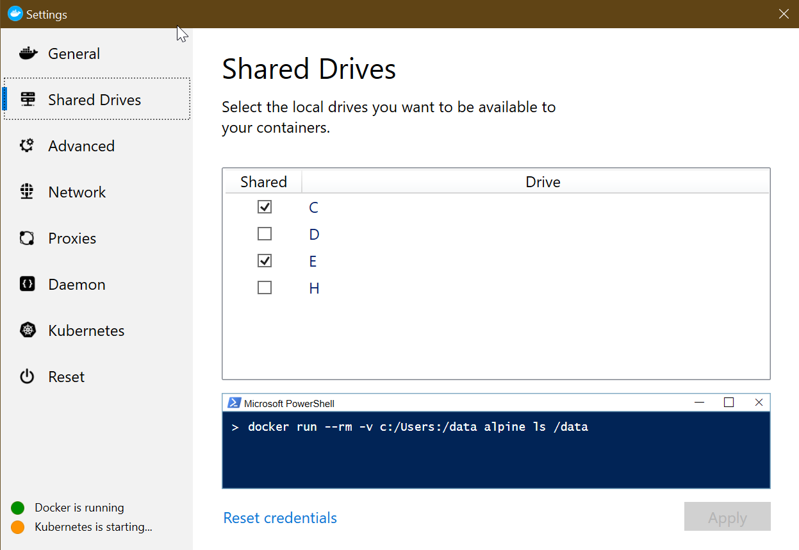
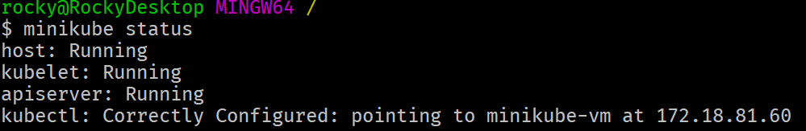
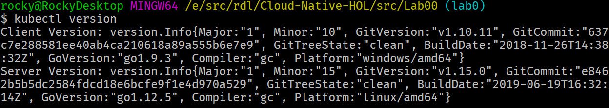

# Confirming Installation of Prerequisites

In this lab we'll confirm that everyone has the software installed for subsequent labs.

See this [list of prerequisites](https://github.com/rockfordlhotka/Cloud-Native-HOL/blob/master/docs/prerequisites.md). ⚠ These must be installed _before arriving at the event_!

## Bash Aliases

1. Open Git Bash
1. Type 'cd ~' to navigate to your user home directory
1. Type `code .bashrc` to edit your profile file
1. Edit the file to match this, then save and exit:

```bash
alias az='winpty az.cmd'
alias minikube='winpty minikube.exe'
alias docker='winpty docker'
```

Close the CLI window when done.

## Chocolatey

1. Open Git Bash
1. Type `choco --version`
1. Ensure that the version is at least `0.10.15`

## Git for Windows

1. Open Git Bash
1. Type `git --version`
1. Ensure that the version is at least `2.23.0`

## Clone/update local repo

If you have not yet cloned the repo

1. Change to your root source directory (such as `cd /c/src`)
1. `git clone https://github.com/rockfordlhotka/Cloud-Native-HOL.git`

If you have already cloned the repo do a pull

1. Change to the repo directory (such as `cd /c/src/Cloud-Native-HOL`)
1. `git pull`

This should ensure that you have a local copy of the latest content from GitHub.

## .NET Core

1. Open Git Bash
1. Type `dotnet --version`
1. Ensure that the version is at least `3.0.100`

## Docker

1. Open the Git Bash CLI
1. Type `docker --version`
1. Ensure that the version is at least `10.03.2`
1. Type `docker run hello-world`
   1. You should get several lines of output, starting with `Hello from Docker!`
1. Share your local drives with Docker
   1. Right-click on the Docker icon in system tray
   1. Select Settings
   1. Choose the Shared Drives tab
   1. Select your working drive(s)



## minikube and Helm

> ⚠ Before starting minikube it is _strongly recommended_ that you close as many apps/games/browsers/etc. as possible. Between Docker and Kubernetes most computers will barely have enough memory to function. Discount this advice if your computer has 32gb RAM or more.

1. Open the Git Bash CLI (**as admin**)
1. Type `minikube version`
1. Ensure that the version is at least `1.4.0`
1. Type `minikube status`
1. Output should appear similar to: 
   1. If minikube is not running follow the instructions to start minikube

### Starting minikube

1. Open an _admin_ PowerShell or cmd window
1. Type `minikube start --vm-driver hyperv --hyperv-virtual-switch "Default Switch" --cpus 6 --memory 4096`
1. Close the window

### Initialize Helm

1. Back in the Git Bash CLI type `helm version`
   1. Version must be 3.0 or higher

### Stopping minikube

**🛑 IMPORTANT:** Don't actually stop minikube, as you'll be using it throughout the day. However, when you do want to stop minikube this is how you do it.

1. In _admin_ Git Bash CLI
   1. Type `winpty minikube ssh "sudo poweroff"`
1. In _admin_ PowerShell or cmd
   1. Type `minikube ssh "sudo poweroff"`

Finally: Close the admin CLI window (type `exit`)

## Kubernetes CLI

1. Open Git Bash (not admin)
1. Type `kubectl version`
1. The result will be version numbers for numerous components
   1. Client versions are for the Kubernetes CLI
   2. Server versions are for minikube



**⚠ NOTE:** The minimum version we need is at least `v1.15.2`.

To fix this on Windows:

1. Open a Git Bash CLI window _as administrator_
1. Change directory to `/c/Program\ Files/Docker/Docker/resources/bin`
1. Type `curl -LO https://storage.googleapis.com/kubernetes-release/release/v1.15.4/bin/windows/amd64/kubectl.exe`

This will download version `v1.15.4` of the tool, overwriting the older version in the Docker directory.

For Mac users you can do something similar, or change a symlink as described in this [Stackoverflow thread](https://stackoverflow.com/questions/55417410/kubernetes-create-deployment-unexpected-schemaerror).

## Azure CLI

1. Open Git Bash
1. Type `az --version`
1. Ensure that the version is at least `2.0.74`
1. Type `az login`
   1. You should get see a browser window
   1. Log into your Microsoft Azure account
   1. The console should now list your subscriptions
   
## Notes for Using Docker Desktop Kubernetes
I ran the whole class without using minikube , the only issue that needed to be addressed is the amount of resources available to Kubernetes. I stopped the Hypervisor manager connection to docker desktop and doubled the memory from 2048 MB to 4096 MB, Also increased the CPU available from 2 to 4GB.
Also in Docker Desktop I increased the resources to 4 CPUs and 4GB.

That allowed the whole class to run inside deocker desktop Kubernetes

