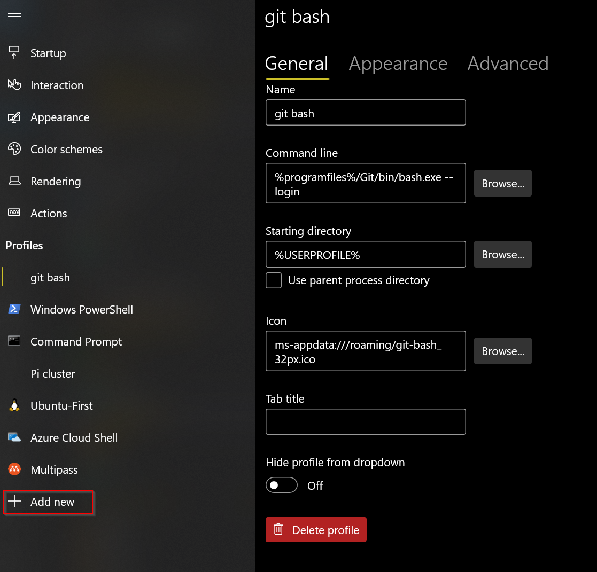
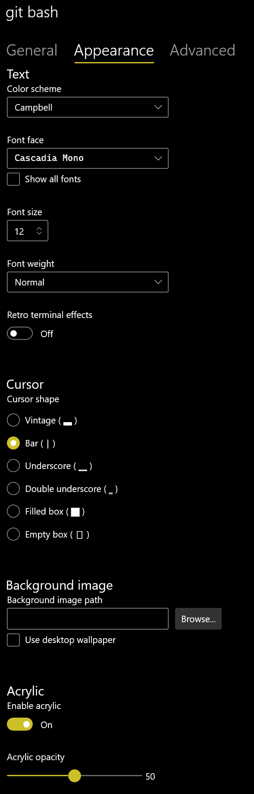

# Confirming Installation of Prerequisites

In this lab we'll confirm that everyone has the software installed for subsequent labs.

See this [list of prerequisites](https://github.com/rockfordlhotka/Cloud-Native-HOL/blob/master/docs/prerequisites.md). ⚠ These must be installed _before arriving at the event_!

## Bash Aliases

1. Open Git Bash
1. Type 'cd ~' to navigate to your user home directory
1. Type `code .bashrc` to edit your profile file
1. Edit the file to match this, then save and exit:

```bash
alias az='winpty az.cmd'
alias docker='winpty docker'
```

Close the CLI window when done.

## Chocolatey

1. Open Git Bash
1. Type `choco --version`
1. Ensure that the version is at least `0.10.15`

## Git for Windows

1. Open Git Bash
1. Type `git --version`
1. Ensure that the version is at least `2.28.0`

## Windows Terminal and Git Bash

> ℹ You can use Git Bash in its own window, but your experience will be far better from Windows Terminal. This is true for "cmd" and PowerShell as well, they are all a better experience when accessed via Windows Terminal.

> ℹ I will be using the Git Bash CLI via Windows Terminal throughout the remainder of the workshop.

1. Open Windows Terminal
1. Open the Settings page
1. Add a new profile as shown



You may optionally set the Appearance to customize the profile. For example, here is mine:



## Clone/update local repo

If you have not yet cloned the repo

1. Change to your root source directory (such as `cd /c/src`)
1. `git clone https://github.com/rockfordlhotka/Cloud-Native-HOL.git`

If you have already cloned the repo do a pull

1. Change to the repo directory (such as `cd /c/src/Cloud-Native-HOL`)
1. `git pull`

This should ensure that you have a local copy of the latest content from GitHub.

## .NET Core

1. Open Git Bash
1. Type `dotnet --version`
1. Ensure that the version is at least `5.0.204`

## Docker

1. Open the Git Bash CLI
1. Type `docker --version`
1. Ensure that the version is at least `19.03.12`
1. Type `docker run hello-world`
   1. You should get several lines of output, starting with `Hello from Docker!`

### Initialize Helm

1. Back in the Git Bash CLI type `helm version`
   1. Version must be 3.0 or higher
1. Type `helm repo add bitnami https://charts.bitnami.com/bitnami`
   1. This adds the list of stable helm charts for use

## Kubernetes CLI

1. Open Git Bash (not admin)
1. Type `kubectl version`
1. The result will be version numbers for numerous components
   1. Client versions are for the Kubernetes CLI
   2. Server versions are for minikube


**⚠ NOTE:** The minimum version we need is at least `v1.17.2`.

To fix this on Windows (if necessary):

1. Open a Git Bash CLI window _as administrator_
1. Change directory to `/c/Program\ Files/Docker/Docker/resources/bin`
1. Type `curl -LO https://storage.googleapis.com/kubernetes-release/release/v1.17.2/bin/windows/amd64/kubectl.exe`

This will download version `v1.17.2` of the tool, overwriting the older version in the Docker directory.

For Mac users you can do something similar, or change a symlink as described in this [Stackoverflow thread](https://stackoverflow.com/questions/55417410/kubernetes-create-deployment-unexpected-schemaerror).

1. Type `kubectl get nodes`
1. You should see a list of one node

**⚠ NOTE:** If you experience long (20-30 second) delays executing kubectl commands on Windows, your system may have issues using IPV6 and the kubectl API is attempting to connect using IPV6 and waiting for a timeout before retrying as IPV4. Disabling IPV6 on both the Virtual Switch and your primary network adapter may solve the problem.

## Azure CLI

1. Open Git Bash
1. Type `az --version`
1. Ensure that the version is at least `2.11.0`
1. Type `az login`
   1. You should get see a browser window
   1. Log into your Microsoft Azure account
   1. The console should now list your subscriptions
