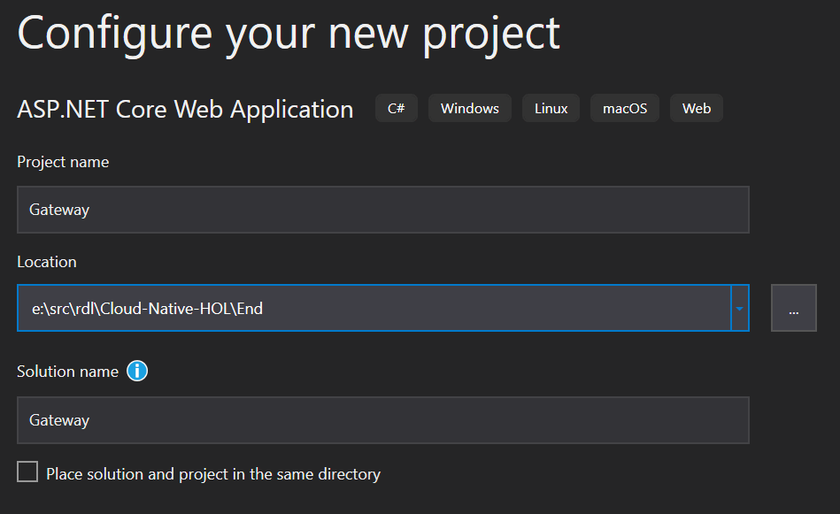
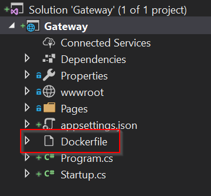
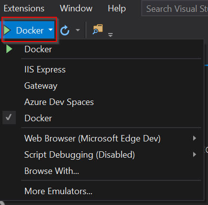
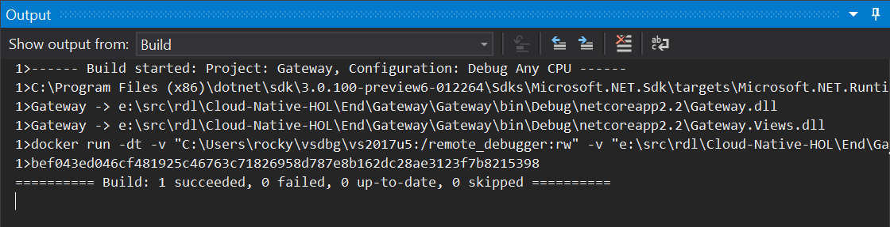
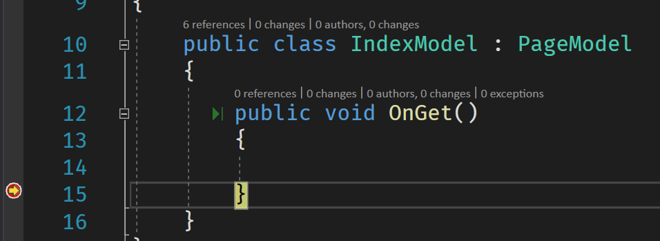
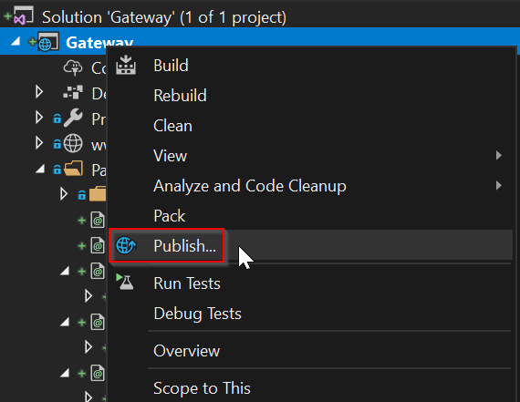
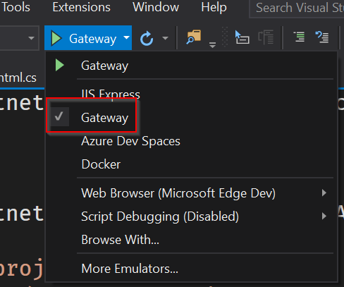
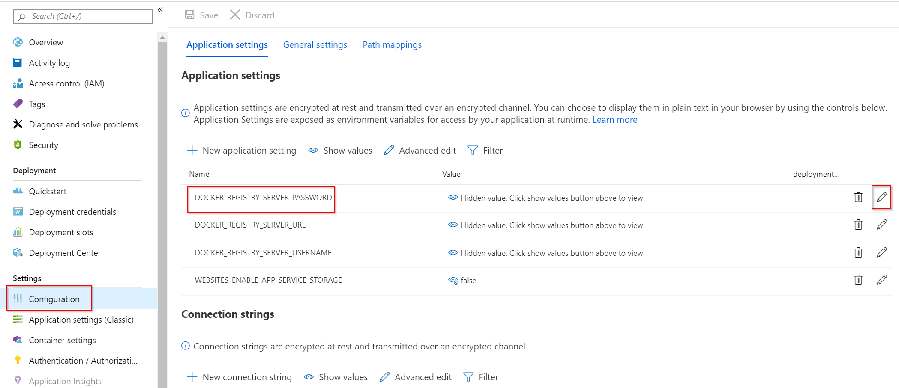

# Build and Deploy ASP.NET Core to Docker

In this lab we'll create an ASP.NET Core website that is hosted in a Docker container, and push that container image to a remote repository so it runs in Azure.

Lesson goals:

1. Learn how to create a container-based ASP.NET Core website
1. Learn how to run a Docker container locally
1. Learn how to debug software in a Docker container
1. Learn how to push a local container image to a remote repository
1. Learn how to deploy a container image to an Azure App Service

## Create Website

### Using Visual Studio

1. Open Visual Studio
1. Create new ASP.NET Core project named `Gateway`   
   1. Choose .NET 6.0 as the Target Framework
   1. Use the *Web Application* template
   1. Uncheck the *Configure for HTTPS* option (to simplify for demo/lab purposes)
   1. Check the *Enable Docker Support* option (For Mac: Right click on project within solution explorer, choose add, choose         Docker Support
   1. Confirm the use of Linux containers
1. Look at Solution Explorer 
   1. Notice how it is a normal ASP.NET Core Razor Pages project
   1. *Except* for `Dockerfile`
1. Look at the run/debug options in the VS toolbar 
   1. Notice it defaults to *Docker*, which runs the app in a Docker container, hosted by the Kestrel web server
   1. You can directly run the app in a console window, in which case it is hosted by the Kestrel web server
   1. You can run the app in WSL, in which case it will be hosted by the Kestrel web server running in a Linux console window
   1. You can still switch to *IIS Express* if desired
1. Press *F5* to debug within Docker
   1. The app should build and run "as normal"
1. Look at the Build Output window 
   1. Notice how the build output looks very different
      1. The project didn't build from VS
      1. VS ran a `docker run` command
      1. The result is a container being created based on `Dockerfile`
      1. The web page in the browser is hosted by ASP.NET Core *in a Linux container*
1. The VS debugger is attached to the code running in the container
   1. Open the `Pages\Index.cshtml.cs` file
   1. Set a breakpoint on the close brace of `OnGet`
   1. Refresh the page in the browser
   1. Notice now the breakpoint is hit as the Index page is reloaded 

### Using text editor (VS-Code) with terminal

in this example I am creating a WebAPi application

1. Create the new app using command line

      ```text
      dotnet new webapi --no-https
      ```

1. Now add a docker file to the Project to dockerrize the application

      ```text
         FROM mcr.microsoft.com/dotnet/aspnet:6.0 AS base
         WORKDIR /app
         EXPOSE 80
         EXPOSE 443

         FROM mcr.microsoft.com/dotnet/sdk:6.0 AS build
         WORKDIR /src
         COPY ["newprojectname.csproj", "./"]
         RUN dotnet restore "./newprojectname.csproj"
         COPY . .
         WORKDIR /src
         RUN dotnet build "newprojectname.csproj" -c Release -o /app/build

         FROM build AS publish
         RUN dotnet publish "newprojectname.csproj" -c Release -o /app/publish

         FROM base AS final
         WORKDIR /app
         COPY --from=publish /app/publish .
         ENTRYPOINT ["dotnet", "newprojectname.dll"]
      ```

Given that *newprojectname* is the name of the project

Opening the folder in VS code should gives you the option to debug inside the container, but you may need to install docker extension and try to add it to the project, what it will do is configure vs-code to allow debugging. It may ask you to overwrite the Dockerfile, you can say yes or no as it basically creates the same thing.

> ℹ You may need to initialize the `UserSecretsId` element in your csproj file. If you get a build warning about this missing element, open a CLI window, navigate to the directory containing the csproj file and execute the `dotnet user-secrets init` command.

## Understanding Dockerfile

Open `Dockerfile` in your editor.

This file defines how the container will be created. In fact, it defines not only the *final* container, but also intermediate containers that'll be used to build our .NET project on Linux.

### Base Image

The first code block defines the "base image" to be used when creating the final container.

```dockerfile
FROM mcr.microsoft.com/dotnet/aspnet:6.0 AS base
WORKDIR /app
EXPOSE 80
```

The base image is typically provided by a vendor or your IT group. In this case it is a Microsoft-supplied image based on Linux, with the ASP.NET Core runtime already installed. Microsoft works hard to minimize the size of this base image.

The `WORKDIR` specifies a directory inside the image where our files will go. This is basically like a `cd` command.

The `EXPOSE` statement indicates that this image will listen on port 80.

### Build the Project

The next code block defines an "intermediate image" used to build the ASP.NET Core project. This intermediate image only exists long enough to do the build, and then it is discarded. It isn't part of the final image, and isn't deployed.

```dockerfile
FROM mcr.microsoft.com/dotnet/sdk:6.0 AS build
WORKDIR /src
COPY ["Gateway/Gateway.csproj", "Gateway/"]
RUN dotnet restore "Gateway/Gateway.csproj"
COPY . .
WORKDIR "/src/Gateway"
RUN dotnet build "Gateway.csproj" -c Release -o /app/build
```

Notice how this image uses a different base image. This base image is also from Microsoft, but includes the dotnet SDK, not just the runtime. It is *much* larger, because it includes the compilers and other SDK tools/components necessary to build dotnet apps.

In this case the `WORKDIR` is set to `/src` and our *local* `csproj` file is copied into the container. The `dotnet restore` command is run to restore NuGet packages, then the rest of our *local* source files are copied into the container.

Finally a `dotnet build` command is run to build the project.

If you've worked with the `dotnet` command line tool at all, this process should seem somewhat familiar, as when building a project on the command line you will often do `dotnet restore` and `dotnet build` just like what's happening here in the container.

The reason the build occurs *inside the container* is so that the restore, build, and publish processes all run within Linux, so the resulting compiled output is compiled *for Linux*.

### Publish the Project

The next code block defines another intermediate image used to publish the results of the previous build step. In this case the new image is based on the previous imtermediate image. That means this new image starts with everything that was already in the previous image, including the `/app` directory that contains the build output.

```dockerfile
FROM build AS publish
RUN dotnet publish "Gateway.csproj" -c Release -o /app/publish
```

The `dotnet publish` command is executed to create publish output based on the code built in the previous step. The result is the same publish output you'd get if you manually ran a `dotnet publish` command, or did a Publish from Visual Studio. 

### Create the Final Image

The last code block creates the final image.

```dockerfile
FROM base AS final
WORKDIR /app
COPY --from=publish /app/publish .
ENTRYPOINT ["dotnet", "Gateway.dll"]
```

Notice how this starts by using the original base image defined at the top of the file: `base`. This is used to create the final image, named `final`. 

This step runs within the context of the previous intermediate container, so we still have access to the `/app` directory that contains the output from `dotnet publish`.

The results of the publish step are copied into this new image's `/app` directory. This might be confusing, but what's happening here is that we're taking only the `dotnet publish` output and copying it from the intermediate image to this final image. None of the `/src` or dotnet SDK or anything else from the intermediate images will carry forward.

In short, the `final` image contains

1. Linux
1. The ASP.NET Core runtime (not SDK)
1. The output from the `dotnet publish` step (our app)

The last line is `ENTRYPOINT`, which specifies the command that Docker should execute when this image is loaded as a container. Basically this says that on startup, run `dotnet Gateway.dll`.

You can try this in VS too. Notice that one of the startup options for run/debug in Visual Studio is Gateway. 

If you select this option and press *ctl-F5* (or *F5*) you'll see that VS opens a console window, runs `dotnet Gateway.dll`, and that becomes a self-hosted web server for your app.

That's exactly what's happening inside this final docker image. When it runs as a container, the CLI command `dotnet Gateway.dll` is executed, causing your app to run as a self-hosted web server.

## Docker Images and Containers

Now that you've run some things via Docker, you can view the images on your workstation. Type `docker image ls` to get a list. That list should include these items:

```text
$ docker image ls
REPOSITORY                                 TAG                      IMAGE ID            CREATED             SIZE
gateway                                    dev                      6c6a43d12ad4        About an hour ago   260MB
mcr.microsoft.com/dotnet/aspnet            6.0                      fe1db87517ca        5 hours ago         260MB
hello-world                                latest                   4ab4c602aa5e        10 months ago       1.84kB
```

There may be others as well, but from Lab00 you should have the `hello-world` image, plus the Microsoft ASP.NET Core base image, plus the newly created `gateway` image.

An image is NOT a container. An image is data on disk. When an image is *running* it runs within a container. You can see the containers running on your workstation by typing `docker ps`. The result should be something like this:

```text
$ docker ps
CONTAINER ID        IMAGE               COMMAND               CREATED             STATUS              PORTS                   NAMES
bef043ed046c        gateway:dev         "tail -f /dev/null"   About an hour ago   Up About an hour    0.0.0.0:57786->80/tcp   tender_panini
```

This container is hosting the gateway web server.

Notice the port mapping: `0.0.0.0:57786->80/tcp`. This indicates that port 80 from *inside* the container is being mapped to our workstation's port 57786.

> ℹ Note that this image is the one created and managed by Visual Studio. You need to build your own image to move forward.

### Building and Running an Image Manually

To build the image for use outside the context of the Visual Studio experience do the following:

1. Change directory to the location of your `Gateway.sln` file
1. Type `docker build -t gateway:lab01 -f Gateway/Dockerfile .`

> ℹ The trailing `.` is important, so make sure to include it in the command line.

In the console window you'll see the build process as each code block in the docker file is exected. Now do `docker image ls` and see something like this:

```text
$ docker image ls
REPOSITORY                                 TAG                      IMAGE ID            CREATED             SIZE
gateway                                    lab01                    a018ebd40e6a        6 minutes ago       210MB
```

You can now execute this image on your local workstation:

```text
docker run -P -d gateway:lab01
```

The `-P` switch indicates that Docker should auto-map a local port to all ports exposed by the container. The `-d` switch indicates that the container should run detached from your console window. If you don't use `-d` then your console window will be attached to the container's stdout (which can be good for troubleshooting).

Now do `docker ps` to see the list of running containers. Make note of the port mapped to the container's port 80. It'll probably be something like 32769.

Using that port number, open a browser tab and go to http://localhost:port to interact with the web server running in that container.

When done, you can stop the container(s) using the `docker stop` command, providing either the CONTAINER ID or NAMES value. For example:

```text
docker stop objective_margulis
```

## Image Repositories

When you ran the `hello-world` app in Lab00, that container image was pulled from a cloud repository called Docker Hub (https://hub.docker.com) down to your workstation, and then a container was created from that locally cached image.

That's the normal flow for running images in containers in Docker (and in Kubernetes). Images are maintained in a repository, are pulled to a local cache, and then loaded into containers.

Many public images are maintained in Docker Hub. Microsoft has recently started moving all their base images to their own public repo (`mcr.microsoft.com`).

Most organizations rely on these vendor-provided public repos for base images, just like developers rely on NuGet or npm. However, most organizations maintain _their own images_ in a private repo, just like they do by creating a private NuGet server.

### Create a Private Repository in Azure

Microsoft Azure, like all major cloud providers, offers a private image repository service. You can create an image repo via the Azure web portal, or via the Azure CLI.

First, you need an Azure resource group to use. If you don't have one, you can create one via the Azure web portal, or command line. For example:

```text
az group create --name MyGroup --location "East US"
```

Replace `MyGroup` with your own resource group name.

From the CLI you can run a command like this:

```text
az acr create --name myrepository --resource-group MyGroup --sku Basic --admin-enabled true
```

> ⚠ You should use a totally lowercase name for your repository, as some commands and URLs are case-sensitive and it is simpler if everything is lower case.

Replace `myrepository` and `MyGroup` with values appropriate for your subscription.

In the [Azure web portal](https://portal.azure.com) click *Create a resource*, pick *Containers* and then *Container Registry*. 

> ℹ Azure refers to a container repository as a registry, which is sadly confusing. Most of the world does appear to use the term "repository".

In the details panel provide a registry name, resource group, enable the Admin user, and pick the Basic SKU. 

In either case we're enabling the Admin user. That's probably not something you'll do in a production environment, but it makes things simpler for our demo/lab purposes because it allows the use of a simple username/password for connectivity.

The admin credentials can be retrieved using the following command line (or via the web portal):

```text
az acr credential show -n myrepository
```

Now you can use those credentials to provide the username and password values to log into the repo from Docker. The username is the _name of your repository_ and the password is one of the values from the `credential show` command:

```text
docker login myrepository.azurecr.io --username username --password-stdin
```

Replace `myrepository` and `username` with your values. Also, once you press enter you'll be on an empty line. Type in (or paste) the password, press ctl-z, then enter. That'll provide the password to the command and you should be logged in.

> ℹ If the login fails, try the other password shown from the `credential show` command. Sometimes special characters in the password cause a problem.

At this point you have a remote image repo and Docker can talk to it.

### Push Image to Repository

Docker can push a locally cached image to a remote repository. To do this you need to "tag" your local image with the name of your remote repo.

Each image can have many tags. Some tags are used to indicate a version number, or the latest version of an image, or a remote repo name. These tags are all just labels referring to the same image.

The `gateway` image you created earlier has the tag `lab01`.

```text
REPOSITORY                                 TAG                      IMAGE ID            CREATED             SIZE
gateway                                    lab01                    6c6a43d12ad4        About an hour ago   260MB
```

Add a tag with the name of your remote repo:

```text
docker tag gateway:lab01 myrepository.azurecr.io/lab01/gateway:lab01
```

Again, replace `myrepository` with your repo name.

If you now type `docker image ls` you should see the new tag. For example:

```text
$ docker image ls
REPOSITORY                                 TAG                      IMAGE ID            CREATED             SIZE
gateway                                    lab01                    6c6a43d12ad4        3 hours ago         260MB
rockyrepo.azurecr.io/lab01/gateway         lab01                    6c6a43d12ad4        3 hours ago         260MB
```

Notice that the IMAGE ID is the same for both entries. That's because this is the same physical image, just with two different tags.

Now that the image has a tag that matches the name of the remote repo, you can push the image to the cloud:

```text
docker push myrepository.azurecr.io/lab01/gateway:lab01
```

Again, replace `myrepository` with your repo name.

You should see something like this:

```text
$ docker push rockyrepo.azurecr.io/lab01/gateway:lab01
The push refers to repository [rockyrepo.azurecr.io/lab01/gateway]
b6dcc5f98c26: Pushed
8f30ea98205c: Pushing [===>                                               ]  9.903MB/154.4MB
782e498a7b74: Pushing [==================================================>]  7.171MB
883b7e18bf71: Pushing [==============>                                    ]  12.37MB/43.75MB
cf5b3c6798f7: Pushing [=======>                                           ]  8.667MB/55.28MB
```

This reveals something pretty interesting about container images: they are actually composed of multiple layered files that get flattened into a single image when run in a container.

What you are seeing here is how each layer of the image is being pushed to the remote repo independently. When the process is complete you should see something like this:

```text
$ docker push rockyrepo.azurecr.io/lab01/gateway:lab01
The push refers to repository [rockyrepo.azurecr.io/lab01/gateway]
b6dcc5f98c26: Pushed
8f30ea98205c: Pushed
782e498a7b74: Pushed
883b7e18bf71: Pushed
cf5b3c6798f7: Pushed
lab01: digest: sha256:c9607f26fce7216e073073d066c0292cfec85f7234de4505f2e2614ff9a2ef80 size: 1370
```

You can now list the images in the Azure registry:

```text
az acr repository list -n myrepository
```

Again, replace `myrepository` with your repo name.

The result should be something like this:

```text
$ az acr repository list -n myrepository
[
  "lab01/gateway"
]
```

You can dive even deeper with the `az acr repository show` command. For example:

```text
$ az acr repository show -n myrepository --image lab01/gateway:lab01
{
  "changeableAttributes": {
    "deleteEnabled": true,
    "listEnabled": true,
    "readEnabled": true,
    "writeEnabled": true
  },
  "createdTime": "2019-07-10T21:23:31.6110695Z",
  "digest": "sha256:c9607f26fce7216e073073d066c0292cfec85f7234de4505f2e2614ff9a2ef80",
  "lastUpdateTime": "2019-07-10T21:23:31.6110695Z",
  "name": "lab01",
  "signed": false
}
```

At this point you've created an ASP.NET Core project, debugged it locally in a Docker container, created a remote repository, and pushed your container image to that remote repo.

## Deploy an Image to an Azure App Service

There are many ways to run a Docker container. Public and private cloud vendors have provided ways to host and run containers directly within their infrastructure. You can also host containers in cross-platform orchestrators like Kubernetes and Cloud Foundry.

If all you need is to host a single container, then Azure App Service is a very simple and easy hosting option.

First, you need an Azure App Service plan. You can create this via the Azure web portal, or the command line. For example:

```text
az appservice plan create --name myAppServicePlan --resource-group MyGroup --sku F1 --is-linux
```

Replace `myAppServicePlan` and `MyGroup` with appropriate names (you'll probably want to reuse your existing resource group name).

Notice that this specifies the use of Linux, and that is important since the goal is to host a Linux-based container.

If you are using the Azure web portal, once the plan has been created you'll see that it is decorated with a penguin to indicate the use of Linux.


If you are using the CLI, when the plan has been created you'll see the details about the plan in the console window. Note that `kind` is set to `linux`:

```dockerfile
  "kind": "linux",
```

Now you can run a container in this plan:

> ⚠ The 1st deployment _may_ fail, but after setting the credentials on the app (see below) and it should retry and then succeed in deploying and starting your app

```text
az webapp create --resource-group MyGroup --plan myAppServicePlan --name MyAppName --deployment-container-image-name myrepository.azurecr.io/lab01/gateway:lab01
```

Replace `MyGroup`, `myAppServicePlan`, `MyAppName`, and `myrepository` with appropriate values. `MyAppName` just needs to be something unique for this app (and within the `*.azurewebsites.net` domain).

It may take a minute or two for the App Service to pull the container image from the repository and get it running. You should be able to open a browser tab and navigate to `http://MyAppName.azurewebsites.net` to interact with your container (replacing `MyAppName` with your chosen name).

### Repository Credentials for the App Service

> ⚠ This step may not be required, because Azure now appears to try and automatically find the credentials. Only follow these steps if the web site doesn't load.

**If the container does not start up** it is because the Azure App Service was unable to automatically discover the credentials for the repository. The following steps will provide those credentials.

This step gives the App Service the credentials so it can pull the container image from your private repository.

```text
az webapp config container set --name MyAppName --resource-group MyGroup --docker-custom-image-name myrepository.azurecr.io/lab01/gateway:lab01 --docker-registry-server-url https://myrepository.azurecr.io --docker-registry-server-user repositoryusername --docker-registry-server-password repositorypassword
```

Replace `MyGroup`, `myAppServicePlan`, `MyAppName`, and `myrepository` with appropriate values just like in the last step.

The `repositoryusername` and `repositorypassword` values are the ones from way back in this lab when we created the container repository. If you've forgotten, you can run `az acr credential show -n myrepository` (replacing `myrepository` with your name).

> ⚠ If you are unable to get this to work, it may be because the CLI is doing something odd with the special characters in the password value. In this case you can set the password via the Azure web portal.

To set the repository password via the Azure web portal:



1. Open the portal and navigate to your App Service
1. Click the *Configuration* option
1. Click to edit the `DOCKER_REGISTRY_SERVER_PASSWORD` entry
1. Paste the password into this value
1. Save changes

It may take a minute or two for the App Service to pull the container image from the repository and get it running. You should be able to open a browser tab and navigate to `http://MyAppName.azurewebsites.net` to interact with your container (replacing `MyAppName` with your chosen name).

What's really impressive about this, is that you are now interacting with the _exact same image and code_ that you were running locally on your workstation via `docker run`! The only difference is that the image is now hosted in Azure instead of on your workstation.

## Closing Down

> 🛑 **WARNING!** Do not close down the Azure resources until the end of the day!

One thing about using public cloud resources such as Azure is that you need to be cost concious. When we're done today you should consider removing all the resources you've set up so you don't have to pay for them to sit idle.

The easiest way to do this is to remove the resource group within which everything is running.

```text
az group delete --name MyGroup
```

As always, replacing `MyGroup` with your resource group name.

>🛑 **WARNING!** This will stop and totally remove all resources within the group.

## References

* [Azure Subscriptions](https://docs.microsoft.com/en-us/azure/guides/developer/azure-developer-guide#understanding-accounts-subscriptions-and-billing)
* [Build a custom image and run in App Service from a private registry](https://docs.microsoft.com/en-us/azure/app-service/containers/tutorial-custom-docker-image)
* [Docker CLI reference](https://docs.docker.com/engine/reference/commandline/cli/)
* [Azure CLI reference](https://docs.microsoft.com/en-us/cli/azure/reference-index?view=azure-cli-latest)
