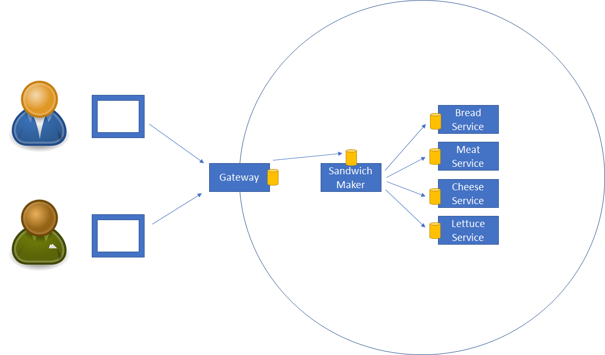
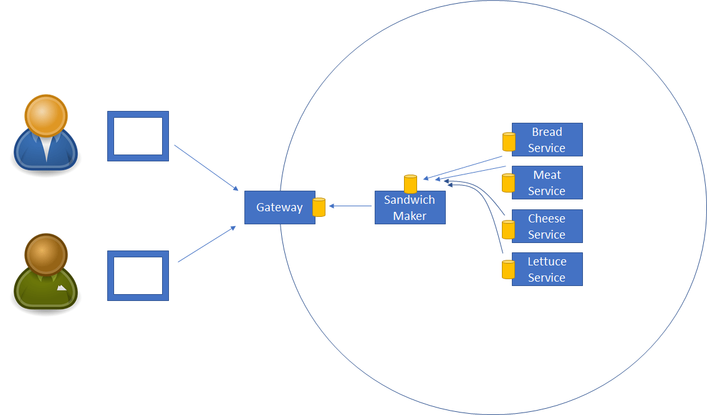
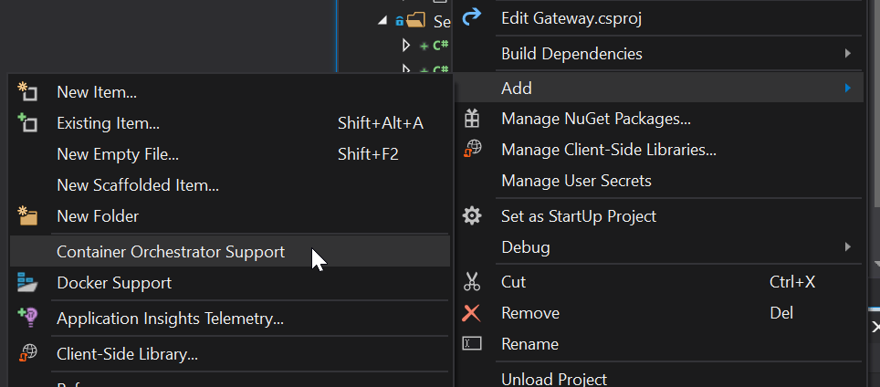
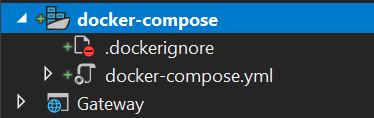
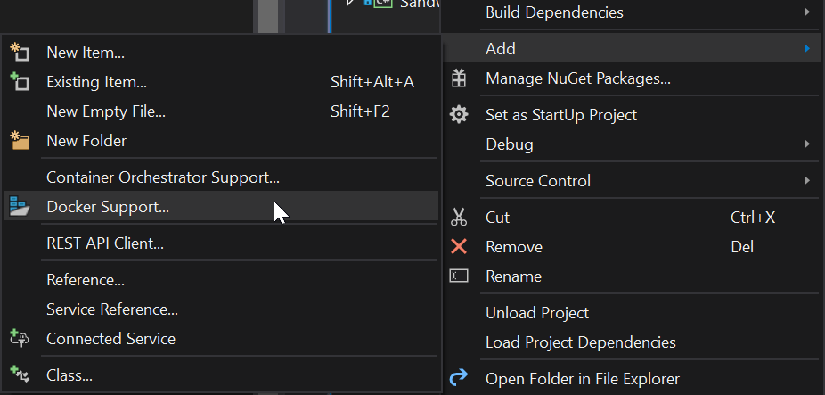
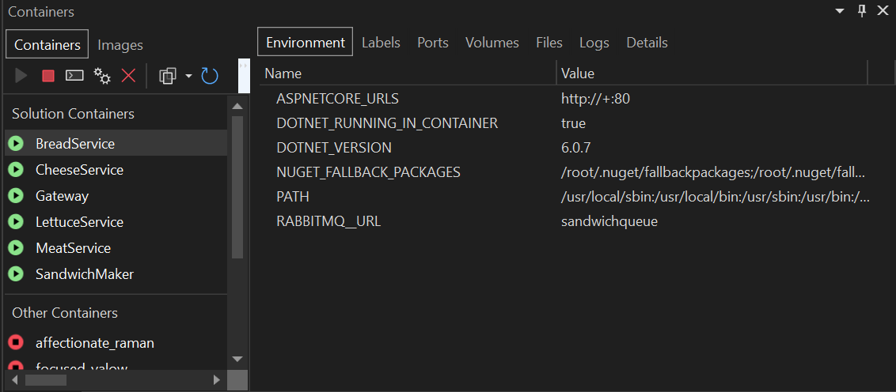

# Design and Build Message-Based Microservices

In this lab we'll build a message-based service-based system that runs in docker-compose. It will use RabbitMQ as a messaging platform.

Lesson goals:

1. Use a gateway server to provide user access to a service-based system
   1. Understand how to implement a "synchronous" user experience to external users
   1. Discuss how SignalR _could_ be used to provide an asynchronous experience to external users
1. Implement message-based services that work together to provide business functionality
1. Install RabbitMQ into docker-compose
1. See how docker-compose provides a convenient developer inner-loop experience
1. Understand how docker-compose.yaml is different from K8s deploy/service definition files
1. Understand compensating transactions

## Terminology

Terminology matters a lot when talking about or working with services. A service is a standalone, autonomous, unit of functionality. So is an app. So apps and services are basically the same thing.

But people talk about building a "service-oriented app" or "microservice-based app". That's nonsense, because that would be an app composed of other apps. Intelligent conversation becomes impossible.

Throughout this and subsequent labs the following terms are used:

* **Service-based**: a term used to encompass SOA and microservices without getting into debates about whether they are the same or different
* **Service** or **app**: an autonomous unit of functionality that can be independently deployed from any other part of the overall system
* **Edge app**: an app that exposes some sort of interface to external consumers
* **Service-based system** (aka **system**): a logical boundary within which all apps/services interact using a common messaging protocol
* **External consumers**: browsers, devices, users, or anything outside the service-based system

## Overview of Solution

At a high level the system consists of a series of apps and services:

1. Gateway app/service - provides access to the service-based system for external consumers
1. Sandwichmaker service - makes sandwiches
1. Bread service - maintains inventory of bread, provides bread upon request
1. Cheese service - maintains inventory of cheese, provides cheese upon request
1. Meat service - maintains inventory of meat, provides meat upon request
1. Lettuce service - maintains inventory of lettuce, provides lettuce upon request

The gateway server literally sits on the boundary of the service-based system, and is therefore available to external consumers and it participates with the system as a peer service. Its primary role is to act as a bridge between external web or mobile based communication protocols and the messaging protocol used _inside_ the service-based system.

The gateway app provides web page and API interfaces for use by external consumers. In today's lab the focus will be on the web page UI.

### Requesting a Sandwich

In the following diagram you can see how users can request a sandwich via their browser.



The browser postback is handled by the gateway server. The gateway sends a message to the sandwichmaker service asking for a sandwich. The sandwichmaker service sends messages (in parallel) to the resource services to get bread, cheese, meat, and lettuce as needed.

There's a bit of cleverness involved, in that the browser postback is "blocked" using an `await` statement until either a sandwich response comes back or a timeout occurs. In other words, the user sees the normal web browser behavior of the web page waiting for a response.

### Advantages of Queued Messaging

Notice how messages flow from a service to a queue, and are then processed from that queue by the receiving service. This is extremely powerful because it is an inexpensive and reliable way for your service-based system to gain:

1. Scalability - if a service becomes overloaded you can just add more instances of the service to process messages from the queue
1. Fault tolerance - if a service instance crashes other running instances will continue to process queued messages as if nothing happened
1. Reliability - if all running service instances crash the pending messages remain in the queue, so when new service instances start up they'll simply resume acting on the pending workload

### Completing Sandwich Request

Each of the resource services typically responds to a request by returning a message with the requested resource. The sandwichmaker service then assembles all the resources into a single response message that it sends to the service that requested a sandwich.



The gateway service has its own queue, so when the sandwichmaker finishes its work and sends a response, that response ends up in the gateway service's queue. The gateway service has a listener running as an ASP.NET Core background task, so it picks up that reply and matches it to the specific user request that originally requested the sandwich. 

When the response arrives on the gateway server and is matched to the original browser postback request, the background service provides the response message to that postback request and unblocks the postback request so it can process the response and generate appropriate output for the browser.

### What if I Don't Want to Block the User?

The implementation in this lab provides the end user with a standard browser-style experience. They fill in a web form, click a button, and the browser doesn't render anything new until there's some sort of response (a sandwich or a timeout).

In modern web user experiences it is increasingly the case that such a scenario is implemented so the browser refreshes _immediately_ upon the user's button click, typically showing the user a message saying that their request has been submitted and they'll be notified when it completes.

It is possible to implement such a scenario using standard web-based technologies. Most commonly this would be done using SignalR to provide async messaging between the web server (gateway app) and the user's browser.

This is not part of today's lab work, but we mention it here so you know that such an implementation is possible.

### What if the Request Fails?

The workflow described so far has assumed everything works as expected. The sandwichmaker service asks for bread, cheese, meat, and lettuce, and gets back everything necessary to make a sandwich.

But what if the lettuce service runs out of lettuce?

It is important to recognize that this is not a failure case for the lettuce service! There's nothing exceptional about having or not having lettuce, both are perfectly valid scenarios. As a result, the lettuce service still responds to the inbound request for lettuce, but in this case it responds by indicating that it has no lettuce.

This implies that any service sending a request to the lettuce service needs to handle a response that provides lettuce _and_ a response that indicates no lettuce is available. That's not hard to envision, and isn't terribly complex.

_However_, there is complexity here! Because sandwichmaker requests bread, meat, cheese, and lettuce _in parallel_. So when it finds out there's no lettuce, it may already have other resources that it can no longer use.

You can image this scenario in real life. A restaurant cook is making a sandwich and has pulled out bread, meat, and cheese onto the workspace. And then they discover there's no lettuce. So what do they do? They put the meat, bread, and cheese back in the bins, tell the waiter that they can't make the requested sandwich, and move on to other work.

The same is true in the digital world. This whole process is called a _compensating transaction_. Another important term is _saga_. The process of making a sandwich, from the initial request from the gateway service until everything is complete is called a saga. One outcome of a saga is complete success. Another outcome is that, based on business rules and decisions, steps are taken to deal with failure.

In this lab a compensating transaction will be used so when the lettuce service indicates there's no lettuce the sandwichmaker service will send messages to the bread, meat, and cheese services - returning the unused inventory items.

This implies that each resource service can not only provide a resource upon request, but that it can also handle a message indicating that a resource is being returned.

## Debugging in docker-compose

Developing in a container-based environment can be complex. It can be challenging to get your dev/debugging environment set up such that you can debug one or more services, while those services are all interacting with each other.

On a small scale it is often easiest to work with docker-compose, because Visual Studio understands how to interact with Docker Desktop and docker-compose within the familiar "F5 dev experience".

> ℹ It is a fairly safe bet to think that Visual Studio will become more integrated with Kubernetes over time. Already Azure Dev Spaces exist, and innovation within the K8s space is occurring at a breakneck pace.

For this lab you'll learn how to run a set of services in docker-compose from Visual Studio, and later you'll learn how to deploy those services into a K8s cluster.

### Configure RabbitMQ for docker-compose

Before running your services in docker-compose it is necessary to set up a RabbitMQ server for use by those services.

1. Create a docker network for the demo
    1. `docker network create -d bridge --subnet 172.25.0.0/16 demonet`
1. Install rabbitmq in the docker environment, under the recently created network, with a name that will be uset to communicate with it.
    1. `docker run -d --name sandwichqueue --net demonet rabbitmq`

At this point a RabbitMQ container is running in Docker Desktop on your workstation, and Docker's internal DNS will recognize it as part of the demonet network, as `sandwichqueue` _inside Docker_.

## RabbitMQ Helper Code

In the `src/Lab03/Start` directory you'll see a pre-existing solution that implements most of the service-based system described earlier in this document. Open that solution. Look for the `RabbitQueue` project and examine the files in that project.

You will be using the types defined in this project to implement the gateway and bread services.

### AsyncManualResetEvent

The `AsyncManualResetEvent` class is an implementation of the `ManualResetEvent` thread locking primitive that is based on the `async`/`await` functionality in modern .NET. Rather than relying on a low-level operating system lock, this implementation relies on the way tasks work in .NET.

The code comes from Stephen Toub @ Microsoft: [Building Async Coordination Primitives](https://blogs.msdn.microsoft.com/pfxteam/2012/02/11/building-async-coordination-primitives-part-1-asyncmanualresetevent/).

### Queue

The `Queue` class is a simple abstraction over the RabbitMQ API provided by the `RabbitMQ.Client` NuGet package.

A number of lines of code are necessary to open a queue and connection, to prepare for and send a message, and to set up an async listener to process messages as they arrive in a queue. Rather than repeating these blocks of code throughout every service implementation they are centralized in this class.

## Implement Gateway Service/App

The `Gateway` project in the solution is similar to the project you created in Lab02, with some differences. This is a server-side Blazor project configured to work with Docker.

### Enabling docker-compose

Visual Studio can help you add docker-compose support to a solution. Right-click on the Gateway project and select *Add|Container Orchestrator Support*.



You will be asked which container orchestrator to use. If you have a choice, choose docker-compose.

You will be asked to choose the Target OS for your containers. Choose Linux.

> ℹ Windows containers are a viable alternative, but modern server development is moving rapidly toward Linux containers.

The wizard will next ask if you want to overwrite the existing `Dockerfile` for the Gateway project. It is recommended to allow the overwrite.

Once the wizard completes you should see a new node in Solution Explorer:



The `docker-compose.yml` file contains the configuration for docker-compose, telling docker-compose what services to run and how to run them.

```yaml
version: '3.4'

services:
  gateway:
    image: ${DOCKER_REGISTRY}gateway
    build:
      context: .
      dockerfile: Gateway/Dockerfile
```

Visual Studio understands this file and adds an option to run your web project in *Docker Compose* as well as the pre-existing options to run in *Docker* or to run the project directly in a console window.

Earlier in this lab you started a RabbitMQ container in Docker, and attached it to a virtual network named `demonet`. It is necessary to tell docker-compose about that virtual network. Add the following to the `docker-compose.yml` file above the `services:` node:

```yaml
networks:
  default:
    external:
      name: demonet
```

One of the more important of the [12 Factors](https://12factor.net) is that configuration should come from the environment, not from a config file or any other asset that might be in source control. In the docker-compose environment this configuration comes from the `docker-compose.yml` file. Edit the `gateway:` node as shown here:

```yaml
  gateway:
    image: ${DOCKER_REGISTRY}gateway
    build:
      context: .
      dockerfile: Gateway/Dockerfile
    environment: 
      - RABBITMQ__URL=sandwichqueue
      - RABBITMQ__USER
      - RABBITMQ__PASSWORD
```

> ℹ the gateway container will connect to the rabbitmq container using its DNS name `sandwichqueue`.

The `environment:` node provides a list of environment variables to be set in each container as it is initialized. These values can be easily retrieved by .NET Core code using the modern configuration subsystem using the default configuration for ASP.NET Core.

In other words, your ASP.NET Core code can easily access the three variables defined here, though in this lab only the URL value is important, because the RabbitMQ instances are using the default user/password values.

### Examine the WorkInProgress Class

Open the `Services/WorkInProgress.cs` file. This simple code exists because it is necessary to keep track of outstanding user requests (browser postback requests) that have requested a sandwich. Remember the overall workflow:

1. User requests a sandwich in their browser
1. Gateway app handles postback, sending a request to the sandwichmaker service
   1. Gateway app "blocks", not sending the browser a response until getting a response or a timeout
1. Sandwichmaker service makes the sandwich and sends a reply message to the gateway service
1. Gateway service receives the reply, and needs to match it to the user request in step 2

This is where the code you are examining becomes important. It is nothing more than a dictionary of work items, indexed by a unique *correlation id* value. This correlation id value is also used to knit together all the work of making a sandwich: the overall saga being implemented.

The `Lock` property maintains a reference to an `AsyncManualResetEvent`. The user postback code will be awaiting this event until the gateway service sets the event because it got a reply from the sandwichmaker service. Before setting the lock though, the gateway service sets the `Response` property so it contains the reply from the sandwichmaker service.

This workflow will become more clear as you implement the code to send and receive messages, as that code will make use of this work in progress implementation.

The `WorkInProgress` instance is made available to other code in the `Gateway` project via dependency injection. In the `Startup` class's `ConfigureServices` method there's a singleton declaration for the type:

```c#
      services.AddSingleton<Services.IWorkInProgress>((e) => new Services.WorkInProgress());
```

Classes requiring access to work in progress information can gain access to this singleton via standard .NET Core dependency injection.

### Implement Service Interfaces

The gateway app accepts inbound postback requests from browsers as each user asks for a sandwich to be created. The gateway service must relay this request from the external consumer into the service-based system. Specifically, it needs to send a message to the sandwichmaker service asking for the sandwich.

Before implementing code in the gateway app/service, it is necessary to define a couple POCO message definition classes and an ASP.NET Core service interfaces that'll be used by the gateway code.

#### Message Definitions

Examine the `SandwichRequest` class in the `Messages` folder of the `Gateway` project.

This is the message that will be sent to the sandwichmaker service to request a new sandwich.

Examine the `SandwichResponse` class in the `Messages` folder.

This is the message that will be sent from the sandwichmaker service to the gateway service to report on whether a sandwich was or was not made as requested.

Remember that most response messages must not only provide _success_ information, but also _failure_ information. It isn't at all exceptional or invalid for the sandwichmaker to be unable to make a sandwich, so success and failure are both perfectly reasonable responses.

#### Service Interface Definitions

Then add a `cs` file defining an `ISandwichRequestor` interface to the `Services` folder in the `Gateway` project:

```c#
using System.Threading.Tasks;

namespace Gateway.Services
{
    public interface ISandwichRequestor
    {
        Task<Messages.SandwichResponse> RequestSandwich(Messages.SandwichRequest request);
    }
}
```

Later you will implement a class that sends a request to make a sandwich into the service-based system. This interface defines the method that you'll implement, but right now the interface makes it possible to implement the code that'll ultimately call that implementation.

### Implement the Index Page

The next step in this process is to implement the `Index` page in the Gateway project.

The markup for the page is already in the project, as it is basic Blazor UI markup:

```html
@page "/"

<h3>Make a sandwich</h3>

@if (request == null)
{
<div>Loading...</div>
}
else
{
  <EditForm Model="@request" OnSubmit="@FormSubmitted">
    <DataAnnotationsValidator />
    <div>Meat</div>
    <InputText @bind-Value="request.Meat" />
    <ValidationMessage For=@(() => request.Meat) />
    <div>Bread</div>
    <InputText @bind-Value="request.Bread" />
    <ValidationMessage For=@(() => request.Bread) />
    <div>Cheese</div>
    <InputText @bind-Value="request.Cheese" />
    <ValidationMessage For=@(() => request.Cheese) />
    <div>Lettuce</div>
    <InputCheckbox @bind-Value="request.Lettuce" />
    <br /><br />
    <input type="submit" value="Save" class="btn btn-primary" />
  </EditForm>

  <p></p>
  <p>Reply from sandwich maker:</p>
  <div style="font-size:24px">@ReplyText</div>
}
```

Some of the code behind in the `@code` block is already in the page as well:

```c#
@code
{
  private Messages.SandwichRequest request;
  private string ReplyText;

  protected override void OnParametersSet()
  {
    request = new Messages.SandwichRequest();
  }

  private async void FormSubmitted(EditContext editContext)
  {
  }
}
```

What isn't yet in the class is the functionality that obtains an `IServiceRequestor` instance via dependency injection. Add this line at the top of the page after the `@page` directive:

```html
@inject Services.ISandwichRequestor requestor
```

Using this `requestor` field it is possible to implement the `FormSubmitted` method:

```c#
  private async void FormSubmitted(EditContext editContext)
  {
    ReplyText = "Processing request...";
    IsWorking = true;
    var result = await requestor.RequestSandwich(request);
    if (result.Success)
      ReplyText = result.Description;
    else
      ReplyText = result.Error;
    IsWorking = false;
    StateHasChanged();
  }
```

The page uses data binding to populate a `SandwichRequest` message object with user input. This method uses that message object and sends it to the service-based system using the `RequestSandwich` method on the `requestor` object.

Once a response is available, the data bound `ReplyText` UI control is updated to reflect the success or failure result from the sandwichmaker service.

### Implement the SandwichRequestor Service

The next step is to implement the `SandwichRequestor` service based on the `ISandwichRequestor` interface.

#### SandwichRequestor Class

Add a `SandwichRequestor` class to the `Services` folder with the following code:

```c#
using Microsoft.Extensions.Configuration;
using System;
using System.Threading.Tasks;
using RabbitQueue;

namespace Gateway.Services
{
  public class SandwichRequestor : ISandwichRequestor
  {
    readonly IConfiguration _config;
    readonly IWorkInProgress _wip;

    public SandwichRequestor(IConfiguration config, IWorkInProgress wip)
    {
      _config = config;
      _wip = wip;
    }

    public async Task<Messages.SandwichResponse> RequestSandwich(Messages.SandwichRequest request)
    {
      var result = new Messages.SandwichResponse();
      var requestToCook = new Messages.SandwichRequest
      {
        Meat = request.Meat,
        Bread = request.Bread,
        Cheese = request.Cheese,
        Lettuce = request.Lettuce
      };
      var correlationId = Guid.NewGuid().ToString();
      var lockEvent = new AsyncManualResetEvent();
      _wip.StartWork(correlationId, lockEvent);
      try
      {
        using (var _queue = new Queue(_config["rabbitmq:url"], "customer"))
        {
          _queue.SendMessage("sandwichmaker", correlationId, requestToCook);
        }
        var messageArrived = lockEvent.WaitAsync();
        if (await Task.WhenAny(messageArrived, Task.Delay(10000)) == messageArrived)
        {
          result = _wip.FinalizeWork(correlationId);
        }
        else
        {
          result.Error = "The cook didn't get back to us in time, no sandwich";
          result.Success = false;
        }
      }
      finally
      {
          _wip.FinalizeWork(correlationId);
      }

      return result;
    }
  }
}
```

This class relies on dependency injection to gain access to the `IConfiguration` instance for the app, and the `IWorkInProgress` singleton instance.

You can see how the .NET configuration subsystem is used to retrieve the URL of the queue. Remember that the value is coming from an environment variable with the name `RABBITMQ__URL` (yes, two underscores). The .NET Core configuration subsystem translates that name into a dictionary key value of `rabbitmq:url`.

It then implements the `RequestSandwich` method that sends the request message to the sandwichmaker service. Some key things to note in this method:

1. The `correlationId` is a unique identifier for the "create a sandwich" saga, and is used throughout the system to coordinate all the work necessary to attempt creation of a sandwich and return the result to the gateway service
1. The `lockEvent` object is what's used to ensure that the postback request doesn't return to the browser until success, failure, or timeout
1. This code uses the `Queue` type from the `RabbitQueue` project to easily interact with RabbitMQ to send the message
1. The `try..finally` block ensures that, even if an exception occurs, the work in progress list is cleaned up regardless of how this saga completes

#### Blocking the Postback

Perhaps the two lines of code that are hardest to understand are these:

```c#
        var messageArrived = lockEvent.WaitAsync();
        if (await Task.WhenAny(messageArrived, Task.Delay(10000)) == messageArrived)
```

The way .NET implements async/await is not well understood by most developers. You may fully understand what's going on here, in which case you can skip this bit of discussion.

The `AsyncManualResetEvent` type provides a locking mechanism that doesn't rely on any underlying operating system locks. Instead it is implemented in a way that relies on the very nature of the Task Parallel Library (TPL) and async/await implementation in .NET.

The first line of code gets the `Task` object representing the `lockEvent` lock. It is possible to directly await this task, but that wouldn't allow for a timeout. Clearly it is necessary to have some sort of timeout, otherwise the user's web page would be waiting forever for a result.

The second line of code awaits two tasks: the `lockEvent` task and a `Delay` task that acts as a timeout. The `WhenAny` method returns when _either_ of these tasks complete.

The puzzling part of this code isn't the workflow, that's fairly clear. The puzzling part is that this code is reasonable to run on a web server.

People's first instant when seeing some sort of "lock" in web server code is to worry about scalability and consumption of the ASP.NET thread pool. Very reasonable concerns to be sure!

This code is implemented in a way that mirrors exactly what happens when you await a call to a database from ASP.NET code. In other words, it has the same scalability and thread pool consumption characteristics as if it was awaiting a database query via ADO.NET, Entity Framework, or Dapper.

In all cases the code is waiting for a callback via some sort of network IO, and is released when that callback occurs (from the database, or in this case from the RabbitMQ listener).

#### Adding the Service to IServiceCollection

With the `SandwichRequestor` service implemented, it is possible to make it available for use in the `Index` page via dependency injection. This is done by adding some code to the `Startup` class:

```c#
      services.AddSingleton<Services.ISandwichRequestor>((e) =>
          new Services.SandwichRequestor(
              e.GetService<IConfiguration>(), 
              e.GetService<Services.IWorkInProgress>()));
```

Because `SandwichRequestor` relies on dependency injection as it is created it is necessary to resolve the `IConfiguration` and `IWorkInProgress` instances as shown here.

At this point you have all the code necessary to send a request from the user through the `Index` page and the `ServiceRequestor` type to the sandwichmaker service.

### Implement the SandwichmakerListener Hosted Service

When the sandwichmaker service is complete, having succeeded or failed in making a sandwich, it sends a message to the gateway service to provide the result. This means that the gateway service needs to always be listening for messages that arrive on the gateway service's queue.

ASP.NET Core supports this concept via something called a Hosted Service. This is a type of ASP.NET Core service that starts as the web site is launched, and keeps running as long as the server is online.

There are many ways to implement and use a Hosted Service. In this lab you'll implement one type of service that is always awaiting messages that arrive in a queue.

#### SandwichmakerListener Class

Add a `SandwichmakerListener` class in the `Services` folder with the following code:

```c#
using Microsoft.Extensions.Hosting;
using System.Threading;
using System.Threading.Tasks;
using RabbitQueue;
using Microsoft.Extensions.Configuration;

namespace Gateway.Services
{
  public class SandwichmakerListener : IHostedService
  {
    readonly IConfiguration _config;
    readonly IWorkInProgress _wip;
    private readonly Queue _queue;

    public SandwichmakerListener(IConfiguration config, IWorkInProgress wip)
    {
      _config = config;
      _wip = wip;
      _queue = new Queue(_config["rabbitmq:url"], "customer");
    }

    public Task StartAsync(CancellationToken cancellationToken)
    {
      _queue.StartListening<Messages.SandwichResponse>((ea, response) =>
      {
        _wip.CompleteWork(ea.BasicProperties.CorrelationId, response);
      });

      return Task.CompletedTask;
    }

    public Task StopAsync(CancellationToken cancellationToken)
    {
      _queue.Dispose();

      return Task.CompletedTask;
    }
  }
}
```

This class relies on dependency injection to gain access to the configuration and work in progress services. In the constructor it also uses the `Queue` class to gain access to the gateway service's queue.

The `IHostedService` interface from ASP.NET requires that the class implement `StartAsync` and `StopAsync` methods. These are invoked by the runtime as the service starts up and shuts down.

The `StopAsync` method simply disposes the `Queue` instance to properly close down.

The `StartAsync` method is more interesting, as this method creates an event hook to process messages in the gateway service's queue. The `StartListening` method invokes a callback method for each message as it arrives.

Inside the callback code the work in progress item is updated via the `CompleteWork` method. Notice that the correlation id value is used to identify the saga (and thus postback browser request) to which this message relates. Also remember that the `CompleteWork` method calls the `Set` method of the `AsyncManualResetEvent` to release the browser postback code so it can return the result to the user's browser.

#### Adding the Service to IServiceCollection

A Hosted Service is added to ASP.NET Core in the `Startup` class like any other dependency injection service. Add the following line of code to the `ConfigureServices` method:

```c#
      services.AddHostedService<Services.SandwichmakerListener>();
```

As the web server starts up it'll automatically create and start an instance of this type.

At this point your code can send and receive messages, enabling full interaction with the sandwichmaker service.

### Examine the SandwichController Class

In the `Gateway` project's `Controllers` folder you'll find a `SandwichController` class. You can uncomment the commented code indicated. All the types it uses now exist in your project. The controller code should look like this:

```c#
using System.Threading.Tasks;
using Microsoft.AspNetCore.Mvc;

namespace Gateway.Controllers
{
  [Route("api/[controller]")]
  [ApiController]
  public class SandwichController : ControllerBase
  {
    readonly Services.ISandwichRequestor _requestor;

    public SandwichController(Services.ISandwichRequestor requestor)
    {
      _requestor = requestor;
    }

    [HttpGet]
    public string OnGet()
    {
      return "I am running; use PUT to make a sandwich";
    }

    [HttpPut]
    public async Task<Messages.SandwichResponse> OnPut(Messages.SandwichRequest request)
    {
      return await _requestor.RequestSandwich(request);
    }
  }
}
```

This lab will not use this controller, but it is worth examining to see how the same types that support the `Index` page can also be used to create an API controller. You can see how this controller supports unknown callers as long as they pass a valid message via an HTML `PUT` call.

## Examine the Sandwichmaker Service

At this point you have a gateway app/service that interacts with the sandwichmaker service. This is a fairly complex service, as it not only interacts with the gateway service, but also with the resource services (for bread, cheese, meat, and lettuce).

You will implement the bread resource service from scratch, but first you should understand key aspects of the sandwichmaker service code.

### Startup

As you'll see when you implement the bread service later, these services are all implemented as console apps. They just listen for, and send, messages to queues, and so there's no need for all the overhead and complexity of ASP.NET. This is very typical of service-based systems.

A major benefit of running code in containers is the high density of services per physical server. Containers themselves require very little memory or overhead, and it is important that your code also use as little memory or resources as possible. You can keep your memory footprint as small as possible by avoiding the use of runtime frameworks like ASP.NET when possible.

Because the sandwichmaker service is a console app, the first code that is run is the `Main` method:

```c#
    static async Task Main(string[] args)
    {
      var config = new ConfigurationBuilder()
        .AddEnvironmentVariables()
        .Build();

      if (_queue == null)
        _queue = new Queue(config["rabbitmq:url"], "sandwichmaker");

      Console.WriteLine("### SandwichMaker starting to listen");
      _queue.StartListening(HandleMessage);

      // wait forever - we run until the container is stopped
      await new AsyncManualResetEvent().WaitAsync();
    }
```

This code is interesting, because it leverages the same .NET Core configuration subsystem as ASP.NET Core, but explicitly:

```c#
      var config = new ConfigurationBuilder()
        .AddEnvironmentVariables()
        .Build();
```

Where ASP.NET Core defaults to loading configuration values from numerous sources (web.config, environment, console parameters, etc.), this code is only loading configuration from the environment.

For debug and testing purposes you might also choose to load config from console parameters, but at runtime config should always flow from the environment.

The code then starts listening for messages to arrive on the sandwichmaker queue. Just like with the `SandwichmakerListener` in the `Gateway` project, each message is handed off to a method for handling.

The final line of code simply waits on a lock that'll never be released. This is because this service should run forever, or until its hosting container is terminated.

### Message Classes

Open the `Messages` folder and notice all the classes. These are all the message types that the sandwichmaker service knows how to send and recieve.

These types are the _exact same types_ used in the other services in the system. Many people's first instinct is to put these types into a central Class Library project, and reference that common assembly from all the services.

> ℹ **THAT WOULD BE A BAD DESIGN CHOICE!!**

Perhaps the most important characteristic of any service-based system is that each service or app can be deployed independently from any other services or apps.

If all services are coupled to a common "master document format" or "master message definition" assembly, the result is that any service that needs to expand or change its message type will force all other services to also adopt/accept those changes.

There are various ways to overcome this issue. You _can_ use a common assembly for message types, as long as you are _extremely_ careful to do so in a way that allows dependent projects (all of your services) to only accept changes when they want the changes. That is complex and requires a lot of human-centric process and coordination.

The _easier_ solution is to avoid having any common assembly across all your services, and have each service maintain its own message definitions.

### Handling Inbound Messages

The sandwichmaker service receives different types of message from numerous other services within the overall system. As a result it needs to examine each message to determine what to do with the message:

```c#
    private static void HandleMessage(BasicDeliverEventArgs ea, string message)
    {
      switch (ea.BasicProperties.Type)
      {
        case "SandwichRequest":
          RequestIngredients(ea, message);
          break;
        case "MeatBinResponse":
          HandleMeatBinResponse(ea, message);
          break;
        case "BreadBinResponse":
          HandleBreadBinResponse(ea, message);
          break;
        case "CheeseBinResponse":
          HandleCheeseBinResponse(ea, message);
          break;
        case "LettuceBinResponse":
          HandleLettuceBinResponse(ea, message);
          break;
        default:
          Console.WriteLine($"### Unknown message type '{ea.BasicProperties.Type}' from {ea.BasicProperties.ReplyTo}");
          break;
      }
    }
```

Fortunately RabbitMQ (using the [AMQP protocol](https://www.amqp.org/)) has provisions for passing metadata such as the message type along with the message payload. This is part of the abstraction implemented in the `RabbitQueue` project's `Queue` class.

Notice that when an unknown message arrives it is handled by writing a message to the console: to stdout for Linux-savvy folks. This is standard practice when building container-based apps. In all major container runtimes stdout and stderr are _expected_ to be used for log output from code running in the container.

You might also use other logging frameworks and techniques, but writing to stdout is generally considered a good practice.

Messages that _are_ recognized are routed to methods that handle the specific message type. For example, when you implement the bread service you'll be sending messages to the sandwichmaker service, and they'll be handled in this `HandleBreadResponse` method:

```c#
    private static void HandleBreadBinResponse(BasicDeliverEventArgs ea, string message)
    {
      Console.WriteLine("### SandwichMaker got bread");
      if (!string.IsNullOrWhiteSpace(ea.BasicProperties.CorrelationId) && 
        _workInProgress.TryGetValue(ea.BasicProperties.CorrelationId, out SandwichInProgress wip))
      {
        var response = JsonConvert.DeserializeObject<Messages.BreadBinResponse>(message);
        wip.GotBread = response.Success;
        SeeIfSandwichIsComplete(wip);
      }
      else
      {
        // got Bread we apparently don't need, so return it
        Console.WriteLine("### Returning unneeded Bread");
        _queue.SendReply("breadbin", null, new Messages.BreadBinRequest { Returning = true });
      }
    }
```

This code attempts to match the inbound message to existing work in progress (yes, the sandwichmaker service also needs to track work in progress). 

If an existing in progress item is found then response from the bread service is attached to the work in progress item, and then a method is called to determine if the sandwich is complete.

No matching work in progress item might exist. In reality this shouldn't happen, but it is wise to write defensive code. Such a message indicates that some orphan request was handled, and the sandwichmaker service has no outstanding work in progress for the response. 

```c#
  _queue.SendReply("breadbin", null, new Messages.BreadBinRequest { Returning = true });
```

This is part of the compensating transaction implementation. The desired business behavior is that if the bread service provides bread to the sandwichmaker service, and that bread can't be used, it is to be returned to the bread service for future use.

### Work in Progress Tracking

As mentioned earlier, the sandwichmaker service needs to track work in progress. This is because it will be handling many concurrent requests to make sandwiches, and it needs to keep track of which are in progress, which are complete, and which can't be completed.

In this service the work in progress information is maintained in a dictionary:

```c#
    private static readonly ConcurrentDictionary<string, SandwichInProgress> _workInProgress =
      new ConcurrentDictionary<string, SandwichInProgress>();
```

Like in the gateway service, the key here is the correlation id for the "make a sandwich" saga that started when the user requested a sandwich.

The data required to track the work required to make a sandwich is fairly complex. You can look at the `SandwichInProgress` class to see what is tracked.

Remember that the sandwichmaker service will request all necessary resources _in parallel_, and there's no way to predict the order of responses from those other services. As a result, as each response does arrive it is recorded in a `SandwichInProgress` object, indexed by the saga's correlation id value.

The `IsComplete` and `Failed` properties implement business logic based on the responses that have arrived at any point in time.

The `IsComplete` property only returns `true` if all four resource services have responded, regardless of whether the response is one of success or failure.

The `Failed` property returns `true` when all four resource services have responded and one or more of the response messages indicate failure.

### Requesting Ingredients (Resources)

The sandwichmaker service handles the `SandwichRequest` message sent from the gateway service (or any other caller really). When such a message is received the result is that a request is sent to each resource service, in parallel, to ask for the required bread, cheese, meat, and lettuce.

The `RequestIngredients` method in the `SandwichMaker` class implements this behavior.

The method sets up a work in progress item to track the process of making the requested sandwich. Then it sends messages to each resource service.

### Compensating Transaction Implementation

The `SeeIfSandwichIsComplete` method is responsible for determining whether the sandwichmaker service has successfully made the requested sandwich.

If the sandwich is complete a success message is sent to the service that requested the sandwich (the gateway service in this implementation). Similarly, if the sandwich couldn't be made a message is also sent to tell the calling service that they can't have their sandwich.

In the case of failure however, it is necessary to implement a compensating transaction. If one or more ingredients aren't available it is very likely that the sandwichmaker service has possession of _other_ resources it no longer needs.

The following code sends messages to the appropriate resource services, telling them to restore ingredients to their inventory for future use:

```c#
  if (wip.GotMeat.HasValue && wip.GotMeat.Value)
    _queue.SendMessage("meatbin", wip.CorrelationId, new Messages.MeatBinRequest { Meat = wip.Request.Meat, Returning = true });
  if (wip.GotBread.HasValue && wip.GotBread.Value)
    _queue.SendMessage("breadbin", wip.CorrelationId, new Messages.BreadBinRequest { Bread = wip.Request.Bread, Returning = true });
  if (wip.GotCheese.HasValue && wip.GotCheese.Value)
    _queue.SendMessage("cheesebin", wip.CorrelationId, new Messages.CheeseBinRequest { Cheese = wip.Request.Cheese, Returning = true });
  if (wip.GotLettuce.HasValue && wip.GotLettuce.Value)
    _queue.SendMessage("lettucebin", wip.CorrelationId, new Messages.LettuceBinRequest { Returning = true });
```

In service-based systems compensating transactions are the normal way this sort of problem is resolved. Keep in mind that this isn't just a technical implementation detail, it is a key part of the overall business process.

## Implement Bread Service

Now that you've seen how the more complex sandwichmaker service is implemented it is time to implement a service from scratch. The resource services are much simpler, but still demonstrate all the key aspects of service implementation.

### Create the Project

Add a new .NET Core Console App project to the solution named `BreadService`. Make sure it targets .NET 5.0.

It needs the following NuGet references:

* `Newtonsoft.Json`
* `RabbitMQ.Client`
* `Microsoft.Extensions.Configuration.CommandLine`
* `Microsoft.Extensions.Configuration.EnvironmentVariables`

It needs the following project references:

* `RabbitQueue`

> 💡 You can copy-paste the reference `ItemGroup` blocks from LettuceService csproj file into the new `BreadService.csproj` file to save time with adding references.

At this point you might be asking why it is OK to reference the RabbitQueue project when earlier we so strongly recommended _against_ referencing a common message definition assembly.

The difference is that the `RabbitQueue` project, much like .NET itself, or `Newtonsoft.Json`, contain no business logic. They are "horizontal frameworks" in that they cut across many apps or services, providing common platform-level functionality.

It is important to minimize or avoid reuse of _vertical_ code: code that is part of any given business implementation. That includes UI components, viewmodels, controllers, message or document definitions, and data access layers. Those are all examples of app-specific code, where reuse will almost certainly lead to coupling. And coupling prevents independent deployment of services and apps - this defeating the primary value of being service-based.

### Message Definitions

Create a `Messages` folder in the project. As with the other services, this one will follow the "shared nothing" strategy to avoid coupling.

Add a `BreadBinRequest` class:

```c#
namespace Messages
{
  internal class BreadBinRequest
  {
    public string Bread { get; set; }
    public bool Returning { get; set; }
  }
}
```

Add a `BreadBinResponse` class:

```c#
namespace Messages
{
  internal class BreadBinResponse
  {
    public bool Success { get; set; }
  }
}
```

The request comes from some other service that needs bread (or needs to return unused bread). The response message is how the bread service indicates success or failure.

### Service Implementation

Like the sandwichmaker service, this is a console app, and so the entrypoint for the code is the `Main` method. This method needs to load configuration, create the `Queue` object, and start listening for inbound messages.

It will need these `using` statements:

```c#
using System;
using Microsoft.Extensions.Configuration;
using RabbitQueue;
using System.Threading.Tasks;
using RabbitMQ.Client.Events;
```

The `Program` class needs to contain this code:

```c#
    private static Queue _queue; 

    static async Task Main(string[] args)
    {
      var config = new ConfigurationBuilder()
        .AddEnvironmentVariables()
        .Build();

      if (_queue == null)
        _queue = new Queue(config["rabbitmq:url"], "breadbin");

      Console.WriteLine("### Bread bin service starting to listen");
      _queue.StartListening<Messages.BreadBinRequest>(HandleMessage);

      // wait forever - we run until the container is stopped
      await new AsyncManualResetEvent().WaitAsync();
    }
```

In a real app the inventory would be maintained in a database. For this lab the inventory will be maintained in memory.

Add this class-level field:

```c#
    private volatile static int _inventory = 10;
```

To avoid any potential issues with shared state, the inventory value is maintained as a `volatile` value. Were the value being retrieved from a database on request this wouldn't be an issue because no shared/`static` state would be necessary.

The `HandleMessage` method is invoked for each message received from the queue. Add this method to the `Program` class:

```c#
    private static void HandleMessage(BasicDeliverEventArgs ea, Messages.BreadBinRequest request)
    {
      var response = new Messages.BreadBinResponse();
      lock (_queue)
      {
        if (request.Returning)
        {
          Console.WriteLine($"### Request for {request.GetType().Name} - returned");
          _inventory++;
        }
        else if (_inventory > 0)
        {
          Console.WriteLine($"### Request for {request.GetType().Name} - filled");
          _inventory--;
          response.Success = true;
          _queue.SendReply(ea.BasicProperties.ReplyTo, ea.BasicProperties.CorrelationId, response);
        }
        else
        {
          Console.WriteLine($"### Request for {request.GetType().Name} - no inventory");
          response.Success = false;
          _queue.SendReply(ea.BasicProperties.ReplyTo, ea.BasicProperties.CorrelationId, response);
        }
      }
    }
```

Notice that a `lock` statement is used to prevent multi-threading reentrancy issues with this code. Again, this is only necessary due to the use of shared state (the `_inventory` field). In most service implementations the `HandleMessage` method will be only interacting with fields scoped to the method, so reentrancy is not a concern.

There are two possible workflows to handle.

One is that the caller is returning bread to inventory, in which case the inventory quantity is incremented.

The other is that the caller is requesting bread. In this case the inventory is checked. If there's bread in inventory the value is decremented and a success response is sent. Otherwise a failure message is sent so the caller knows no bread is available.

Although this implementation is simple, you should be able to see how the `HandleMessage` method could be much more complex, interacting with databases or other services (as shown in the sandwichmaker service).

### Adding Docker Support

Adding Docker support to a Console App project requires adding a `Dockerfile` and editing the `csproj` file.

#### Visual Studio 2019

Visual Studio 2019 provides support for adding Docker support to a Console App project as it does for a web project.



Selecting this option, and choosing Linux, will result in Visual Studio adding a `Dockerfile` to your project.

At this point your project can be built into a Docker container.

### Adding docker-compose Support

The docker-compose environment provides a useful way to run and debug a set of related services and apps. As discussed earlier today, the `docker-compose.yml` file in the docker-compose node in Solution Explorer defines all the services that are to be hosted by docker-compose.

Make sure this file contains an entry for the new `breadservice`:

```yaml
  breadservice:
    image: ${DOCKER_REGISTRY}breadservice
    build:
      context: .
      dockerfile: BreadService/Dockerfile
    environment: 
      - RABBITMQ__URL=sandwichqueue
      - RABBITMQ__USER
      - RABBITMQ__PASSWORD
```

At this point your `docker-compose.yml` file contains entries only for the `gateway` and `breadservice` services. In reality it needs entries for all the services necessary to run the system in your local environment.

Copy the `docker-compose.yml` file from the `End` directory into your `Start` directory, replacing the current file. The result is a `docker-compose.yml` that has entries for all the services in the system.

## Running in docker-compose

At this point you should be able to press F5 or ctrl-F5 to run the solution in docker-compose.

If you request a sandwich with lettuce it'll fail right away, because that service has an inventory level of 0 to start. You should be able to request other sandwich combinations until running out of inventory.

Notice the output of the Build window in Visual Studio and how it varies from a regular build process. Because the build is creating container images and launching them via Docker, the process is quite different.

Once the services are running, notice the Containers window in Visual Studio.



You can use this window to explore each of the containers running in Docker, including their configuration, ports, file systems, logs, and more.
