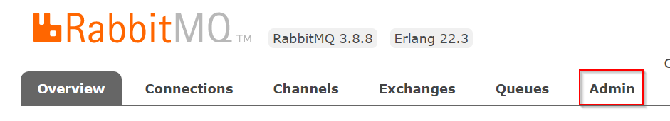
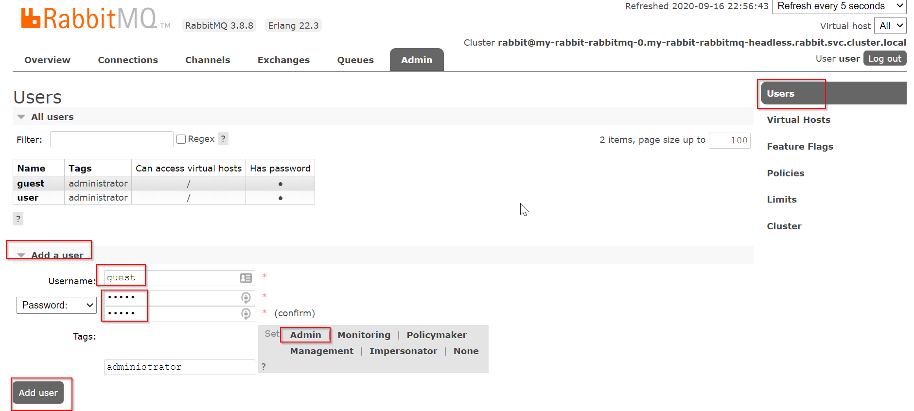

# Install RabbitMQ Using Helm

In this lab you will install RabbitMQ into a Kubernetes cluster using Helm.

Lesson goals:

1. Use Helm to deploy RabbitMQ

## Deploy to Kubernetes

The final step in this lab is to deploy the services to K8s. The docker-compose environment is convenient for the F5 experience and debugging, but ultimately most production systems will run on K8s or something similar.

### Deploy RabbitMQ to Kubernetes

Open a CLI window.

1. Type `helm install my-rabbitmq bitnami/rabbitmq`
1. Helm will display information about the deployment
   1. Copy-paste the command to retrieve the RabbitMQ password (make note of value)
   1. Copy-paste the command to retrieve the RabbitMQ erlang key (make note of value)
1. Explore the installation
   1. Type `helm list` to list installed releases
   1. Type `kubectl get pods` to list running instances
   1. Type `kubectl get services` to list exposed services

At this point you should have an instance of RabbitMQ running in minikube. The output from `kubectl get services` should be something like this:

```text
$ kubectl get services
NAME                   TYPE        CLUSTER-IP       EXTERNAL-IP   PORT(S)                                 AGE
kubernetes             ClusterIP   10.96.0.1        <none>        443/TCP                                 88d
my-rabbitmq            ClusterIP   10.107.206.219   <none>        4369/TCP,5672/TCP,25672/TCP,15672/TCP   8m
my-rabbitmq-headless   ClusterIP   None             <none>        4369/TCP,5672/TCP,25672/TCP,15672/TCP   8m
```

Make note of the service name, and also notice how it has been provided with a `CLUSTER-IP` address. This address is how the RabbitMQ service is exposed within the K8s cluster itself. This isn't a hard-coded or consistent value however, so later on you'll use the _name_ of the service to allow our other running container images to interact with RabbitMQ in the next lab.

### Configure Guest User in RabbitMQ

In a production environment you (or your IT ops team) will create one or more user accounts in RabbitMQ for use by your apps. The "default" username/password is guest/guest, and this is disabled in the Helm chart install for security reasons.

For the purposes of the next lab, to keep things as simple as possible, it is necessary to enable the guest user in RabbitMQ. This is done using the administrative web GUI provided by RabbitMQ.

In the CLI window, enable the RabbitMQ management plugin:

```text
rabbitmq-plugins enable rabbitmq_management
```

Now use the `kubectl port-forward` comamnd to create a network tunnel from localhost to the RabbitMQ container running in Kubernetes.

```text
kubectl port-forward svc/my-rabbit-rabbitmq 15672:15672
```

> ⚠ Make sure `my-rabbit-rabbitmq` matches the service name from Kubernetes.

Now open a browser and navigate to `localhost:15672`. Use the credentials provided for RabbitMQ from when you ran the Helm chart ealier to log into the web portal.

Click the Admin option.



On the admin screen, click Users, then Add a user, then add a user with the username `guest` and password `guest` and the tag `administrator`.



## References

* https://phoenixnap.com/kb/install-and-configure-rabbitmq-on-kubernetes
