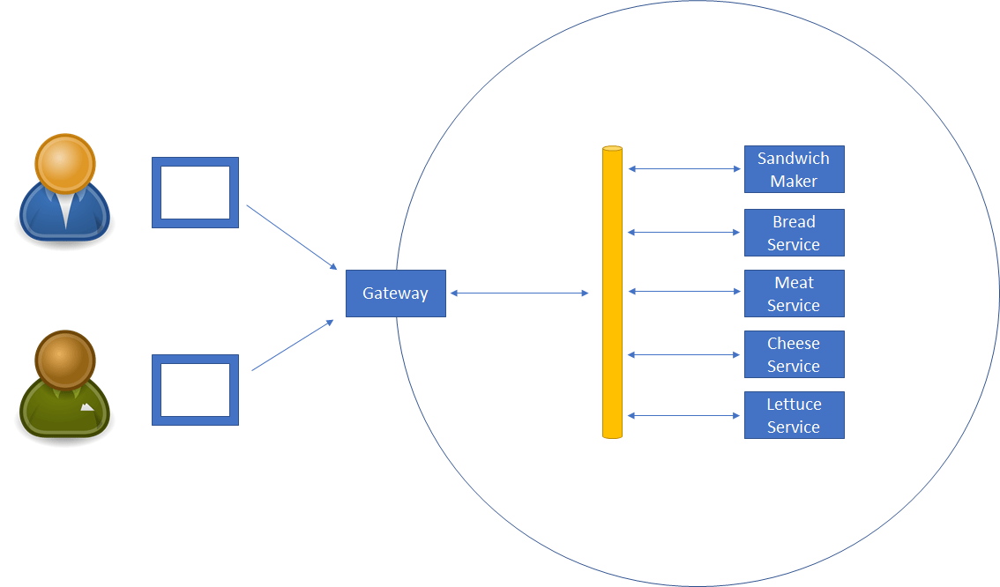
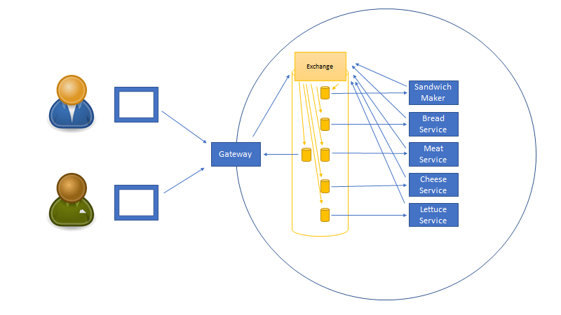

# Service bus messaging

In this lab we'll update the code from Lab03 to use a service bus messaging model instead of direct queues.

Lesson goals:

1. Understand the difference between direct queued messaging and service bus messaging

## Overview of Service Bus Messaging

In Lab03 each service has its own queue, and when a consumer wants to send a message to a service it delivers the message to that specific queue.

In a service bus model messages are sent to the "service bus" instead of to any specific queue.

If you have ever dabbled in building your own PC or taken a computer architecture class in college/university you are probably familiar with the concept of a _bus_. The idea is that a message is "put on the bus", and all devices attached to the bus have the opportunity to handle (or ignore) that message.

 A software bus follows the same philosophy. Any message sent to the bus is available to all services using that bus. Most services ignore (filter out) most messages, only choosing to receive and handle messages that apply to the specific service.
 
 When implementing a very basic service bus with RabbitMQ all messages are sent to an _exchange_, and all services subscribe to that exchange by attaching their own queue to the exchange (usually with a filter). Messages are tagged with what RabbitMQ calls a _binding key_ to allow routing and filtering of messages.
 
 
 
 Logically this is the same as the first diagram, but this diagram shows what is happening behind the scenes.
 
 Anything sending a message is called a _publisher_, and the term _publish_ is used to describe sending a message to the bus (the exchange).
 
 Services that want to handle messages from the bus do the following:
 
 1. Open a connection to RabbitMQ
 1. Create a queue to store messages until they can be processed
 1. Create a (usually filtered) subscription that routes messages from the exchange to the queue
 1. Listen for messages on the queue, and process them as they arrive
 
 Notice that this approach requires the same number of queues as the direct queue approach in Lab03. Each service still has its own queue, the only difference here is in how messages are sent/published.
 
 The _advantage_ to a service bus approach is that the publishers need to know less than they did in the direct queue model. In this case all publishers _always_ send messages to the bus, not knowing or caring which services might handle those messages.
 
 Messages are tagged with a binding key to allow subscribers to filter out messages inappropriate for a given service.
 
 The _drawback_ to this approach is that if no subscriptions exist for a specific type of message, that type of message will just disappear. When a message is published to a service bus, it is either picked up by one or more subscriptions or it just disappears because nobody was listening.
 
 > If a publisher publishes a message in the forest and nobody is subscribed to hear the message, was the message really published? ;)
 
 One thing to also keep in mind, is that a single message can be delivered to _multiple subscriptions_ at the same time. Sometimes this is desired behavior, but in the case of the sandwichmaker system that is undesirable.
 
 Consider the case where two replicas of the bread service are running. If each subscribes to the bus, filtering for "BreadBin" messages, they could _both_ get every message. That's not good, because each message should be processed one time, not _n_ times.
 
 When implementing a bus it is important to keep that possibility in mind, and consciously choose an implementation where multiple instances of the same service rely on the same subscription and queue, so each message is handled exactly one time.
 