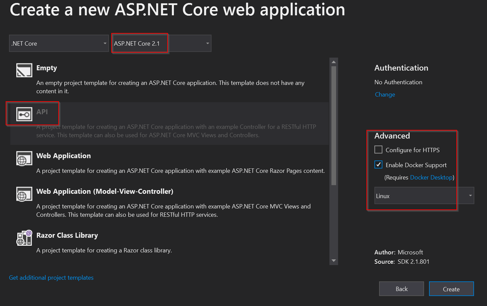

# HTTP Messaging

In this lab we'll update the code from Lab03 to use direct HTTP messaging instead of direct queue messaging.

Lesson goals:

1. Understand the difference between direct queued messaging and HTTP-based messaging
1. Set up cluster-level service definitions for all services so they have IP addresses
1. Use configuration to avoid hard-coding IP addresses

## Background

Perhaps the most common way people implement service-based systems is using HTTP messaging (or as a lot of people say: HTTP service calls). 

### Message-based vs Imperative Calls

The terminology here is important, because true service-based systems _always_ rely on loosely coupled messaging for communication. Imperative method or service calls are always problematic.

At some level that's just semantics, because you really _are_ making a direct HTTP request to a service endpoint in the code. But at another, important, level it is more than semantics, because the service still has three possible outcomes:

1. The service does the requested work (a valid response)
2. The service refuses to do the request work (a valid response)
3. The service is unreachable or has an exceptional failure (an invalid response)

This mentality is absolutely critical to hold in the forefront of software design, even when using HTTP-based messaging (where it is easy to fall back to thinking these are imperative "method calls").

### Retaining Loose Coupling

As discussed in Lab03, each service must be standalone. The goal is to share no code between services - at least not business or message definition code.

As a result, even with HTTP messaging each service defines its own message types, relying on the underlying JSON serialization to mediate minor differences between the messages each service supports over time.

For example, a service can always add new fields to a message type without breaking existing consumers of the service. This clearly must be done with care, as older consumers won't provide any values in those new fields, but older consumers won't _break_ just because a new field is now supported for newer consumers.

### Using HttpListener vs Full ASP.NET Core

One of the attractions to using HTTP messaging is that every service can be implemented as an ASP.NET Core project, providing a familar environment within which to write the service implementation. And this is the approach used in this lab.

However, it is worth noting that it is also possible to implement services as console apps, where the console app uses the `HttpListener` type to listen for inbound HTTP requests. This coding model is more similar to that from Lab03. You do lose a lot of the supporting functionality provided by ASP.NET Core.

The advantage to using ASP.NET Core is the familiar and powerful environment within which your service implementation runs.

The drawback to using ASP.NET Core is that it is comparatively heavy weight. It brings in a whole set of supporting functionality, and if you don't use that functionality then you are bloating the size of your container image on disk and in memory on the server.

### Retry Policies

Retry policies are _critical_ in an HTTP based implementation. It is a "nice to have" in a queue-based model, because RabbitMQ will normally be configured in a fault tolerant manner, so it really won't ever be unavailable (for all practical purposes).

But with HTTP messaging it is _very_ likely that your software will encounter cases where the target of an HTTP call is momentarily offline. This can happen during rolling updates, or maintenance scenarios where nodes are taken offline and put online. In other words, momentary unavailability of an HTTP service endpoint should be _expected_.

As a result, all outbound HTTP calls must be wrapped in retry policies for the system to function as expected. Such policies are not optional in an HTTP based environment.

### Reliability via the Service Fabric

Along with the retry policy requirement, it is important to recognize that implementing a service-based system with HTTP _requires_ the use of a self-healing service fabric.

Without queues, if a service is down, it is unreachable and all consumers of that service become blocked. As a result, any environment hosting such a service must immediately recognize that the service is down and be able to automatically restart the service. This new instance of the service will then handle the _retries_ from the consumers.

So it is a combination of the consumer using a retry policy, and the hosting service fabric rapidly detecting that a service is down and starting a replacement instance that makes HTTP based systems practical.

Fortunately this is a core feature of Kubernetes.

### Scaling via the Service Fabric

Another benefit of using queues is how they make scaling services easy and inexpensive. The same can be true of HTTP messaging if the hosting environment supports such scaling.

> ℹ This discussion is using the word "service" in two ways: the logical _business service_ like the bread service, and a component of Kubernetes called a "service".

For example, in Kubernetes each of your _logical_ services (like the bread service) is exposed to all other K8s services via a _Kubernetes service_. 

The K8s service exposes an IP address, and routes any calls to that IP address to the _actual_ IP address(es) of the K8s pods hosting the containers that implement the logical service.

The default K8s service is a load balancer, which means that multiple replicas of the logical service can be running at the same time, and the K8s service will route calls to those various instances using a round robin algorithm, thus spreading the load across all the replicas.

### Rolling Upgrades

The K8s service capabilities that allow for scaling and load balancing also support rolling updates of containers.

While a container is running, you can apply a new desired state for the cluster to run a different version of the container image (just like you did in previous labs).

With HTTP messaging, the K8s service (load balancer) is involved in the process of routing all existing HTTP calls to the old/existing replicas, and routing all new HTTP calls to the new replicas as they spin up.

Once all old HTTP calls have been processed, the old replicas are spun down, leaving the system running only the new container image.

### Compensating Transactions

As with the Lab03 implementation, compensating transactions remain the primary way to deal with failures within the system. 

The sandwichmaker service still sends requests to the resource services in parallel. And one or more of those services might be out of the requested resource, leaving the sandwichmaker holding resources it can't use.

So the sandwichmaker service must recognize that it can't make the sandwich, and that it has these unneeded resources, and send messages to those resource services to return the unused inventory.

## Update the System

In the interest of time many of the services have already been updated. The two most interesting services to update are the gateway and sandwichmaker services, and you'll do the updates on those, plus create an updated bread service from scratch.

Open the `ServicesDemo` solution from the `Lab05/Start` directory.

Notice that the `RabbitQueue` project is no longer present, as it isn't necessary for HTTP based messaging.

### Update the Gateway Service

The `Gateway` project is still an ASP.NET Core web project. However, notice that the `Services` folder is gone. The helper code for working with RabbitMQ is no longer necessary.

Because the `RabbitQueue` project is no longer part of the solution, it is necessary to update the `Dockerfile` in the `Gateway` project to remove the line that used to pull in the `RabbitQueue` project. Remove this line:

```docker
COPY RabbitQueue/RabbitQueue.csproj RabbitQueue/
```

The `Messages` folder remains, and if you look there you'll see that the `SandwichRequest` and `SandwichResponse` types are unchanged. Just because these messages are transferred via HTTP instead of a queue doesn't change the nature of the messages themselves.

In the `Pages/Index.cshtml.cs` file you'll see much the same code as before. Add a retry policy field declaration in the class:

```c#
    readonly Policy _retryPolicy = Policy.
      Handle<Exception>().
      WaitAndRetry(3, r => TimeSpan.FromSeconds(Math.Pow(2, r)));
```

The `OnPut` method is empty, ready for a new HTTP messaging implementation. Update it as follows:

```c#
    public async Task OnPut()
    {
      var request = new Messages.SandwichRequest
      {
        Meat = TheMeat,
        Bread = TheBread,
        Cheese = TheCheese,
        Lettuce = TheLettuce
      };
      var server = _config["sandwichmaker:url"] + "/api/sandwichmaker";

      await _retryPolicy.Execute(async () =>
      {
        using (var httpResponse = await _httpClient.PutAsJsonAsync(server, request))
        {
          if (httpResponse.IsSuccessStatusCode)
          {
            var result = await httpResponse.Content.ReadAsAsync<Messages.SandwichResponse>();
            if (result.Success)
              ReplyText = result.Description;
            else
              ReplyText = result.Error;
          }
          else
          {
            throw new HttpRequestException(
              $"Couldn't reach sandwichmaker at {server}; Response: {httpResponse.ReasonPhrase}");
          }
        }
      });
    }
```

As before, a `SandwichRequest` message is populated from the values entered by the user in the web UI.

The server address is generated, combining the sandwichmaker service's server address with the API designation for the controller.

The `_retryPolicy` field is used to wrap the HTTP request, so if that request fails there will be a series of retries with an exponential back-off.

The HTTP request itself uses the `HttpClient` instance provided via dependency injection to the page. The `PutAsJsonAsync` method is used so the content of the `SandwichRequest` message is automatically serialized into JSON to be sent over the network.

The HTTP response is checked to see if the HTTP call was successful. If so, the result is used to update the UI so the user knows whether or not the sandwich was created.

If the HTTP response is not successful an exception is thrown. This will trigger the retry policy, and if the service won't successfully respond after the retries the exception information will be displayed in the browser.

> ℹ In a real app the exception would be handled to provide the user with some more friendly display.

As you can see, sending a message to a service via HTTP isn't much different from sending a message via a queue. It is a _little_ simpler, in that the call to `HttpClient` automatically blocks, where we had to use an `AsyncManualResetEvent` to block until a reply message was received in the queued messaging model.

You can look at the `Controllers/SandwichController` to see a similar implementation.

In the `Startup.cs` file it is necessary to provide the `HttpClient` to pages and controllers vai dependency injection. Add this line to the `ConfigureServices` method:

```c#
      services.AddTransient<HttpClient>();
```

This provides an instance of `HttpClient` to the page and controller as needed.

### Update the Sandwichmaker Service

Now open the `SandwichMaker` project. Notice that this is now also an ASP.NET Core web project instead of a simple Console App project.

In the interest of time, this project already includes the `Messages` folder with all the same message types as in Lab03. The one difference is that in Lab03 most of these types were scoped as `internal` because they were used only by the service's code. Now they are all scoped as `public` because they will be used to communicate via HTTP.

All the real work will occur in the `SandwichMakerController` class in the `Controllers` folder, so open that file.

Notice how it relies on dependency injection to get access to configuration and an `HttpClient` instance:

```c#
    private readonly IConfiguration _config;
    private readonly HttpClient _httpClient;

    public SandwichMakerController(IConfiguration config, HttpClient httpClient)
    {
      _config = config;
      _httpClient = httpClient;
    }
```

Add a class level field to declare a retry policy.

```c#
    readonly Policy _retryPolicy = Policy.
      Handle<Exception>().
      WaitAndRetry(3, r => TimeSpan.FromSeconds(Math.Pow(2, r)));
```

This class does have an `OnGet` method:

```c#
#if DEBUG
    [HttpGet]
    public string OnGet()
    {
      return "I am running; use PUT to request a sandwich";
    }
#endif
```

In a production setting you probably won't have such a method. But for learning about, and debugging, container-based deployments it is often worth having such a method so you can easily use a browser to determine if a service is running at a given IP address or DNS name.

The service implementation will be in the `OnPut` method. Update it as follows:

```c#
    [HttpPut]
    public async Task<Messages.SandwichResponse> RequestSandwich(Messages.SandwichRequest request)
    {
      Console.WriteLine($"### Sandwichmaker making {request.Meat} on {request.Bread}{Environment.NewLine} at {DateTime.Now}");
      var wip = new SandwichInProgress(request);

      var requests = new List<Task>
      {
        RequestBread(wip, new Messages.BreadBinRequest { Bread = wip.Request.Bread }),
        RequestMeat(wip, new Messages.MeatBinRequest { Meat = wip.Request.Meat }),
        RequestCheese(wip, new Messages.CheeseBinRequest { Cheese = wip.Request.Cheese }),
        RequestLettuce(wip, new Messages.LettuceBinRequest { Returning = false })
      };

      var result = new Messages.SandwichResponse();

      var timeout = Task.Delay(10000);
      if (await Task.WhenAny(Task.WhenAll(requests), timeout) == timeout)
      {
        await ReturnInventory(wip);
        result.Error = "The cook didn't get back to us in time, no sandwich";
        result.Success = false;
        return result;
      }

      result.Success = !wip.Failed;
      if (result.Success)
      {
        result.Description = wip.GetDescription();
      }
      else
      {
        result.Error = wip.GetFailureReason();
        await ReturnInventory(wip);
      }

      return result;
    }
```

This method relies on a `SandwichInProgress` type, which is very similar to the type from Lab03. It maintains information on which resource services have replied at any given point in time. That is important, because messages are sent to all the resource services in parallel, so some location is required to track their responses as they come in.

Next a list of `Task` object is created by calling methods such as `RequestBread`. Each of these methods is responsible for sending a message to a resource service. Add the `RequestBread` method implementation to the class:

```c#
    private Task RequestBread(SandwichInProgress wip, Messages.BreadBinRequest request)
    {
      if (string.IsNullOrEmpty(wip.Request.Bread)) return Task.CompletedTask;

      return _retryPolicy.ExecuteAndCapture<Task>(()=>
        _httpClient.PutAsJsonAsync(
          _config["breadservice:url"] + "/api/breadbin",
          request).
          ContinueWith(async (e) => HandleMessage(await e.Result.Content.ReadAsAsync<Messages.BreadBinResponse>(), wip))
      ).Result;
    }
```

> ℹ The other `Request___` methods are already implemented.

This method returns immediately without doing any work if the user didn't request any bread on their sandwich. Otherwise it uses the retry policy to wrap a `PutAsJsonAsync` call that sends a message to the bread service.

Notice the use of `ContinueWith` to process the response from the resource service. It calls a `HandleMessage` method that accepts the `BreadBinResponse` message. Add an implementation of `HandleMessage` for this type:

```c#
    private void HandleMessage(Messages.BreadBinResponse response, SandwichInProgress wip)
    {
      lock (wip)
      {
        wip.GotBread = response.Success;
      }
    }
```

> ℹ The other `HandleMessage` methods are already implemented.

This method is responsible for updating the work in progress object with the information provided in the response message from the bread service.

Back in the `OnPut` method, the next step in the process is to wait for the resource services to respond, or for a timeout:

```c#
      var timeout = Task.Delay(10000);
      if (await Task.WhenAny(Task.WhenAll(requests), timeout) == timeout)
```

This is very similar to the code in Lab03, except in this case the code waits for _all_ of the resource services to reply, _or_ for the timeout to occur.

If the timeout occurs then a response is sent to the caller indicating that the sandwich couldn't be made due to a timeout. 

```c#
        await ReturnInventory(wip);
        result.Error = "The cook didn't get back to us in time, no sandwich";
        result.Success = false;
        return result;
```

Notice that this code calls a `ReturnInventory` method as well. You'll implement this method later. For now know that it implements a compensating transaction to return any resource inventory that _did_ get provided before the timeout occurred.

Otherwise the code checks to see if the work in progress object recorded that all the ingredients/resources were returned and generates a result accordingly:

```c#
      result.Success = !wip.Failed;
      if (result.Success)
      {
        result.Description = wip.GetDescription();
      }
      else
      {
        result.Error = wip.GetFailureReason();
        await ReturnInventory(wip);
      }
      return result;
```

Notice that if no sandwich was made, this code calls the `ReturnInventory` method to initiate a compensating transaction to return any unused resource inventory.

The `ReturnInventory` method relies on the work in progress object to know which resources were retrieved from the resource services. Any resources are returned by sending a message to that resource service. Implement the method as shown here:

```c#
  private async Task ReturnInventory(SandwichInProgress wip)
    {
      var requests = new List<Task>
      {
        RequestBread(wip, new Messages.BreadBinRequest { Bread = wip.Request.Bread, Returning = true }),
        RequestMeat(wip, new Messages.MeatBinRequest { Meat = wip.Request.Meat, Returning = true }),
        RequestCheese(wip, new Messages.CheeseBinRequest { Cheese = wip.Request.Cheese, Returning = true }),
        RequestLettuce(wip, new Messages.LettuceBinRequest { Returning = true })
      };

      var timeout = Task.Delay(10000);
      if (await Task.WhenAny(Task.WhenAll(requests), timeout) == timeout)
      {
        Console.WriteLine($"### Timeout returning inventory");
        throw new TimeoutException("ReturnInventory");
      }
    }
```

This code is very similar to the code from the `OnPut` method, except that the messages being sent to each resource service specify `Returning = true` so the resource service knows that inventory is being returned instead of requested.

Again, a timeout is used so the end user isn't left forever on a hung browser page.

At this point the solution should build, because the `Gateway` and `SandwichMaker` projects are complete. However, the system won't yet run, because there's no bread service implementation.

### Create the Bread Service

Add an ASP.NET Core project to the solution named `BreadService`.

Make sure to use ASP.NET Core 2.1 with the API template. Don't enable SSL and do enable the project for use by Docker with a Linux container.



> ℹ In a real project you will be able to use other versions of ASP.NET Core (such as 2.2 or 3.0), but the code provided for this lab assumes the use of version 2.1. Remember that each service is entirely standalone, so in reality you could create this service with a whole other stack, like Java or Python, and it would fit seamlessly into the overall system.

#### Add docker-compose Support

When you created the project you indicated it should support Docker, so a `Dockerfile` has already been created in the project. However, at the solution level you still need to add an entry in the `docker-compose.yml` file for this service:

```yaml
  breadservice:
    image: ${DOCKER_REGISTRY-}breadservice
    build:
      context: .
      dockerfile: BreadService/Dockerfile
```

This ensures that the service will run along with all the other services within the docker-compose environment.

#### Add Messages Folder

Because each service maintains its own business logic and message definitions, it is necessary to add a `Messages` folder to the project, so do that. Then add the two message types in this folder:

```c#
namespace Messages
{
  public class BreadBinRequest
  {
    public string Bread { get; set; }
    public bool Returning { get; set; }
  }
}
```

And 

```c#
namespace Messages
{
  public class BreadBinResponse
  {
    public bool Success { get; set; }
  }
}
```

These types will be used by the controller implementation.

#### Add BreadBin Controller

In the `Controllers` folder, delete the sample `ValuesController.cs` file. Then add a new empty API controller named `BreadBinController`.

To start, this class will need a couple fields:

```c#
    private static readonly object _lock = new object();
    private volatile static int _inventory = 10;
```

The `_lock` field will be used to protect the `_inventory` field against multi-threaded access. The `_inventory` field will store the current inventory value.

> ℹ In a real app the inventory would almost certainly be maintained in a database, so the use of a lock and a volatile field would be unnecessary.

Add an `OnPut` method to provide the service implementation:

```c#
    [HttpPut]
    public Messages.BreadBinResponse RequestBread(Messages.BreadBinRequest request)
    {
      var response = new Messages.BreadBinResponse();
      lock (_lock)
      {
        if (request.Returning)
        {
          Console.WriteLine($"### Request for {request.GetType().Name} - returned");
          _inventory++;
        }
        else if (_inventory > 0)
        {
          Console.WriteLine($"### Request for {request.GetType().Name} - filled");
          _inventory--;
          response.Success = true;
        }
        else
        {
          Console.WriteLine($"### Request for {request.GetType().Name} - no inventory");
          response.Success = false;
        }
      }
      return response;
    }
```

Notice how similar this is to the implementation from Lab03. This is because it does the same thing: accept a `BreadBinRequest` message and update the inventory quantity accordingly, returning a `BreadBinResponse` message to the consumer.

The only real difference here is that the reply message is returned as a result of the `OnPut` method instead of explicitly sent as a message. _Conceptually_ though, you should think of this as being a reply message, not a return value from a method!

At this point the gateway, sandwichmaker, and bread services are all complete. Your solution should build, and you are ready to configure the system to run in docker-compose.

## Running the System in docker-compose

When using queue-based messaging none of the services in the system needed to directly interact with each other. They relied on the shared RabbitMQ queuing system for all communication.

With HTTP based messaging this changes. Now some of the services need to directly interact with other services, meaning that they need to know the IP addresses of those services.

Remember in the code that every `HttpClient` call relied on a `_config[""]` value to get the name or IP address of the service to be called. Those config values are provided from the runtime environment: in this case docker-compose.

Additionally, docker-compose needs to understand the relationship between the services to ensure that services that depend on other services are loaded _after_ the other services have been run.

All of this is handled within the solution-level `docker-compose.yml` file. Open this file, and update the `gateway` service entry as shown:

```yaml
  gateway:
    image: ${DOCKER_REGISTRY-}gateway
    build:
      context: .
      dockerfile: Gateway/Dockerfile
    depends_on:
      - sandwichmaker
    environment: 
      - SANDWICHMAKER__URL=http://sandwichmaker
```

This indicates that the `gateway` container depends on the `sandwichmaker` container, and also provides the `gateway` container with an environment variable with the URL of the sandwichmaker service.

Notice that the URL relies on a logical name: `sandwichmaker`. This is because docker-compose kindly creates cluster-level DNS entries for all services defined in `docker-compose.yml` so the name of the service resolves to the IP address of the running container. As a result, `http://sandwichmaker` really is the address to the container when it is running in docker-compose.

Similarly, update the `sandwichmaker` service entry:

```yaml
  sandwichmaker:
    image: ${DOCKER_REGISTRY-}sandwichmaker
    build:
      context: .
      dockerfile: SandwichMaker/Dockerfile
    depends_on:
      - breadservice
      - cheeseservice
      - meatservice
      - lettuceservice
    environment: 
      - BREADSERVICE__URL=http://breadservice
      - CHEESESERVICE__URL=http://cheeseservice
      - MEATSERVICE__URL=http://meatservice
      - LETTUCESERVICE__URL=http://lettuceservice
```

This is a little longer, but the same concepts apply. The `sandwichmaker` service depends on all the resource services. And environment variables are set up to provide the service with the URLs for all the resource services.

At this point you should be able to run the system in docker-compose via F5 or ctrl-F5.

Try making a sandwich. Try making a sandwich with lettuce to see it fail. You can put a breakpoint in the `OnPut` method of the `BreadBinController` class to see requests come in for bread, and to return bread for a compensating transaction.

## Running the System in Kubernetes

Just like with docker-compose, when running an HTTP based messaging system in Kubernetes it is necessary for some services to have the IP addresses of other services at runtime. Because these IP addresses are dynamically assigned, it is necessary to rely on K8s configuration and DNS names to get these addresses.

### Creating the Service Configuration Files

Kubernetes doesn't provide a way to get the IP address of a pod directly. Instead it relies on the concept of a _Kubernetes service_ to provide an IP address, and then that service routes calls to instances of a pod (running a container deployment).

You've already seen this with the `gateway-service.yaml` file that defines the gateway service's K8s service (load balancer). In that particular case however, the service defines not only a cluster-level IP address, but also a public/external IP address. Here's that file as a refresher:

```yaml
apiVersion: v1
kind: Service
metadata:
  name: gateway
spec:
  type: LoadBalancer
  ports:
  - port: 80
  selector:
    app: gateway
```

Creating a private, cluster-level, service definition is very similar. Add a `sandwichmaker-service.yaml` file to the `deploy/k8s` directory:

```yaml
apiVersion: v1
kind: Service
metadata:
  name: sandwichmaker
spec:
  ports:
  - port: 80
  selector:
    app: sandwichmaker
```

Notice that there's no `type:` specification in this version. That's because the default type for a service is `ClusterIP`, and that only exposes the service to other pods within the K8s cluster. Which is exactly what is needed for all the services in this system except for the gateway service, because it provides a web UI for external consumers.

> ℹ Service definition files for the other services are already created in the `deploy/k8s` directory.

At this point all the containers that'll run in K8s will also have a K8s service associated with them.

### Updating the Deployment Configuration Files

The gateway and sandwichmaker services both rely on environment variables to know the DNS names of the other services with which they interact. In Kubernetes, environment variables are provided as part of the deployment configuration.

In the `gateway-deployment.yaml` file you need to add an `env:` element that sets the `SANDWICHMAKER__URL` environment variable:

```yaml
apiVersion: apps/v1
kind: Deployment
metadata:
  name: gateway
spec:
  selector:
    matchLabels:
      app: gateway
  replicas: 1
  strategy:
    rollingUpdate:
      maxSurge: 1
      maxUnavailable: 1
  minReadySeconds: 5
  template:
    metadata:
      labels:
        app: gateway
    spec:
      containers:
      - name: gateway
        image: rockyrepo.azurecr.io/gateway:lab05
        resources:
          limits:
            memory: "128Mi"
            cpu: "500m"
        env:
        - name: SANDWICHMAKER__URL
          value: http://sandwichmaker
      imagePullSecrets:
      - name: acr-auth
```

Similarly, edit the `sandwichmaker-deployment.yaml` file and add an `env:` element beneath the `resources:` element, making sure it is indented to the same level:

```yaml
        env:
        - name: SANDWICHMAKER__URL
          value: http://sandwichmaker
        - name: BREADSERVICE__URL
          value: http://breadservice
        - name: CHEESESERVICE__URL
          value: http://cheeseservice
        - name: MEATSERVICE__URL
          value: http://meatservice
        - name: LETTUCESERVICE__URL
          value: http://lettuceservice
```

> ℹ Given that the names are the same between docker-compose and K8s you might argue that the values could be just hard-coded. But following 12 Factor design, it is always best to externalize such values to environmental configuration than to hard-code.

With these changes these two deployments will now provide the necessary configuration to the containers hosting the services.

### Updating the run-k8s.sh Script

The `run-k8s.sh` bash script applies the desired state from the configuration files into the cluster using `kubectl apply` commands. It needs to be updated to also apply the service definitions. Update the file as shown:

```bash
#!/bin/bash

kubectl apply -f gateway-deployment.yaml
kubectl apply -f gateway-service.yaml
kubectl apply -f breadservice-deployment.yaml
kubectl apply -f breadservice-service.yaml
kubectl apply -f cheeseservice-deployment.yaml
kubectl apply -f cheeseservice-service.yaml
kubectl apply -f lettuceservice-deployment.yaml
kubectl apply -f lettuceservice-service.yaml
kubectl apply -f meatservice-deployment.yaml
kubectl apply -f meatservice-service.yaml
kubectl apply -f sandwichmaker-deployment.yaml
kubectl apply -f sandwichmaker-service.yaml
```

Now it will apply the deployments, the gateway service, and all the other service definitions as well.

### Building the Images

In the `deploy` directory there's a `build.sh` bash script that builds all the images for the system. Open a Git Bash CLI window and do the following:

1. Change directory to `deploy`
1. `chmod +x build.sh`
1. `./build.sh`

This will build the Docker image for each service in the system based on the individual `Dockerfile` definitions in each project directory.

### Replace myrepository With the Real Name

Most of the files in the `deploy/k8s` directory refer to `myrepository` instead of the real name of your ACR repository. Fortunately it is possible to use bash to quickly fix them all up with the correct name.

1. Open a Git Bash CLI
1. Change directory to `deploy/k8s`
1. Type `grep -rl --include=*.sh --include=*.yaml --include=*.yml 'myrepository' | tee | xargs sed -i 's/myrepository/realname/g'`
   * ⚠ Replace `realname` with your real ACR repository name!

### Tagging the Images

In the `deploy/k8s` directory there's a `tag.sh` bash script that tags all the images created by `build.sh`. Open a Git Bash CLI and do the following:

1. Change directory to `deploy/k8s`
1. `chmod +x tag.sh`
1. `./tag.sh`

This will tag each container image with the repository name for your ACR instance.

### Pushing the Images

In the `deploy/k8s` directory there's a `push.sh` bash script that pushes the local images to the remote repository. Open a Git Bash CLI and do the following:

1. Change directory to `deploy/k8s`
1. `chmod +x push.sh`
1. `./push.sh`

The result is that all the local images are pushed to the remote ACR repository.

### Applying the Kubernetes State

At this point you have all the deployment and service definition files that describe the desired state for the K8s cluster. And you have all the Docker container images in the ACR repository so they are available for download to the K8s cluster.

> ⚠ **IMPORTANT:** before applying the desired state for this lab, _make sure_ you have done the cleanup step in the previous lab so no containers are running other than RabbitMQ. You can check this with a `kubectl get pods` command.

The next step is to apply the desired state to the cluster by executing each yaml file via `kubectl apply`. Open a Git Bash CLI window and do the following:

1. Change directory to `deploy/k8s`
1. `chmod +x run-k8s.sh`
1. `./run-k8s.sh`
1. `kubectl get pods`

The result is that the desired state described in your local yaml files is applied to the K8s cluster.

If you immediately execute (and repeat) the `kubectl get pods` command you can watch as the K8s pods download, load, and start executing each container image. This may take a little time, because as each pod comes online it needs to download the container image from ACR.

> ℹ Depending on the number of folks doing the lab, and the Internet speeds in the facility, patience may be required! In a production environment it is likely that you'll have much higher Internet speeds, less competition for bandwidth, and so spinning up a container in a pod will be quite fast.

Make sure (via `kubectl get pods`) that all your services are running before moving on to the next step.

You can get details about a pod with a command such as:

```text
kubectl describe pod sandwichmaker-bcf6499fc-88svg
```

Use the actual name of a pod from your deployments.

### Exploring the Services

The `kubectl` command allows you to examine the current state of objects in the cluster. For example, you can get a list of services with `kubectl get services`:

```text
NAME                   TYPE           CLUSTER-IP       EXTERNAL-IP   PORT(S)                                 AGE
breadservice           ClusterIP      10.106.226.116   <none>        80/TCP                                  3h51m
cheeseservice          ClusterIP      10.105.137.130   <none>        80/TCP                                  3h51m
gateway                LoadBalancer   10.100.22.77     <pending>     80:30005/TCP                            3h1m
kubernetes             ClusterIP      10.96.0.1        <none>        443/TCP                                 57d
lettuceservice         ClusterIP      10.100.123.255   <none>        80/TCP                                  3h51m
meatservice            ClusterIP      10.99.243.193    <none>        80/TCP                                  3h51m
my-rabbitmq            ClusterIP      10.100.232.75    <none>        4369/TCP,5672/TCP,25672/TCP,15672/TCP   9h
my-rabbitmq-headless   ClusterIP      None             <none>        4369/TCP,5672/TCP,25672/TCP,15672/TCP   9h
sandwichmaker          ClusterIP      10.96.79.232     <none>        80/TCP                                  3h51m
```

You can get details about a specific service with a command such as:

```text
kubectl describe service gateway
```

Once all your pods are running it should be possible to interact with the system.

### Test the System

Open a browser and interact with the system to see it in action.

1. Open a CLI window _as administrator_
1. Type `minikube service gateway`
   1. This will open your default browser to the URL for the service - it is a shortcut provided by minikube for testing

> ⚠ An Admin CLI window (e.g. run as administrator) is required because interacting with the `minikube` command always needs elevated permissions.

## Tearing Down the System

Once you are done interacting with the system you can shut it down. In the `deploy/k8s` directory there's a `teardown.sh` bash script that uses `kubectl` to delete the deployment and service items from the cluster:

```bash
#!/bin/bash

kubectl delete deployment gateway
kubectl delete service gateway
kubectl delete deployment breadservice
kubectl delete deployment cheeseservice
kubectl delete deployment lettuceservice
kubectl delete deployment meatservice
kubectl delete deployment sandwichmaker
```

Open a Git Bash CLI window and do the following:

1. Change directory to `deploy/k8s`
1. `chmod +x teardown.sh`
1. `./teardown.sh`

## Tearing Down Minikube

You should stop minikube before suspending or shutting down your host operating system.

Using an _admin_ CLI, stop minikube:

1. In Git Bash
   * `winpty minikube ssh "sudo poweroff"`
1. In cmd or PowerShell
   * `minikube ssh "sudo poweroff"`

## Removing Azure Resources

This was the final lab. You may wish to remove all Azure resources used today.

The easiest way to do this is to remove the resource group within which everything is running.

```text
az group delete --name MyGroup
```

As always, replacing `MyGroup` with your resource group name.

>🛑 **WARNING!** This will stop and totally remove all resources within the group.

## References

* [Kubernetes Services, Ingress, and repeated Nodes](https://www.mirantis.com/blog/introduction-to-yaml-part-2-kubernetes-services-ingress-and-repeated-nodes/)
